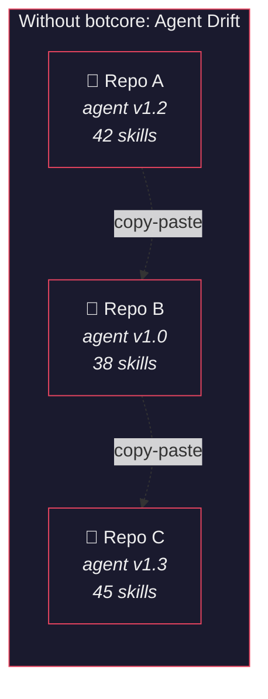
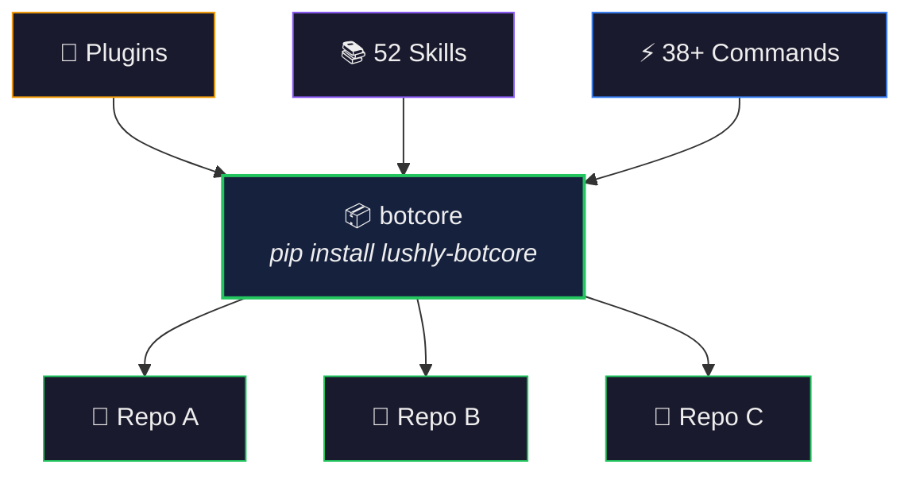
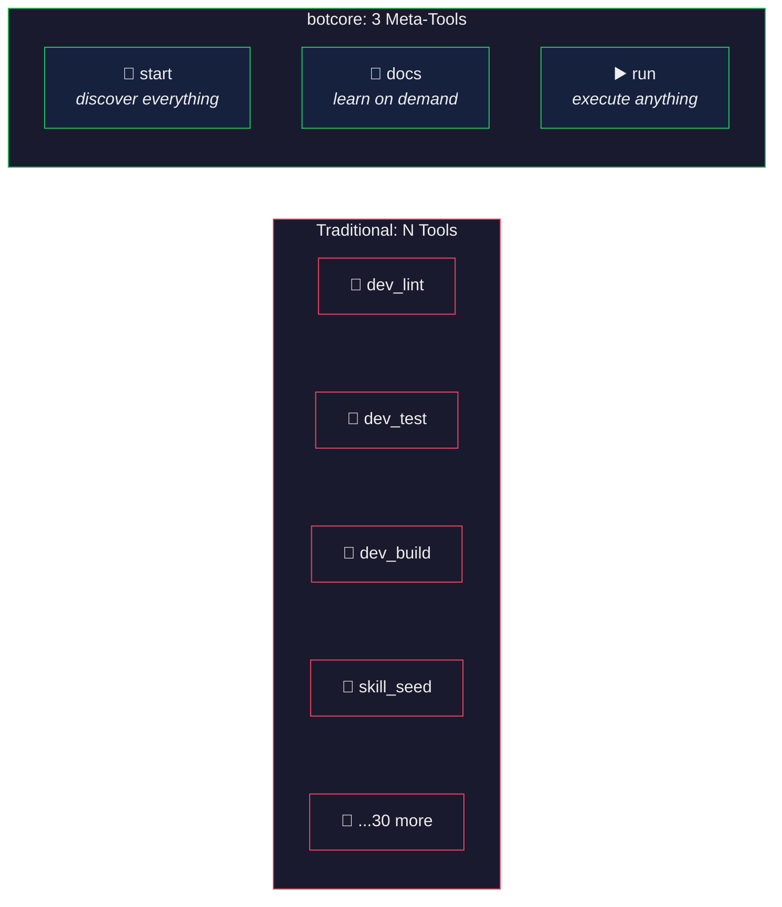
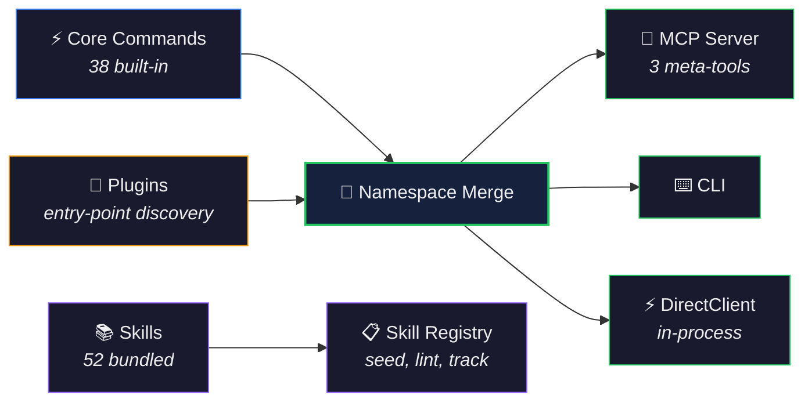

# botcore — Shared Bot Infrastructure

[](LICENSE)
[](#)
[](https://github.com/lushly-dev/botcore/releases)
[](#)
[](#)
[](https://github.com/lushly-dev/afd)
[](https://github.com/sponsors/Falkicon)

> 🟢 **Beta** · Stable and in active use across multiple repositories. APIs are mostly stable; expect targeted iterative improvements. Feedback welcome!

> **Reference pair:** botcore delivers shared command/skill infrastructure; AFD provides the command-first architecture contract those commands are designed to follow. See https://github.com/lushly-dev/afd.

**What happens when every repo needs great agent tooling?**

You build it in one project, copy it to the next. Maybe you symlink. Maybe you create junctions. The skills diverge. The commands drift. A fix in one repo never reaches the others. Before long, you're maintaining five slightly different agents across five repositories — same tools, different versions, different bugs.

botcore ends the drift. Shared bot infrastructure — commands, skills, configuration, and plugins — delivered as a single `pip install`. Plugins extend it per-project. Skill ownership tiers let central updates flow without overwriting local customizations. One package, every repo, always in sync.

---

## The Problem: Agent Drift

When you work across multiple repositories, each one needs capable agent tooling — linters, test runners, quality gates, skill libraries. The natural solution is copy-paste. And copy-paste creates drift.



But the problem isn't just organizational. When these tools are exposed to AI agents via MCP, there's a second issue: **token overload**. An MCP server with 30+ commands means the agent loads 30+ tool schemas into its context window before doing any real work. Some models silently fail when the tool list gets too large.

## The Solution: Shared Infrastructure

botcore solves both problems at once. Centralize the infrastructure, then deliver it efficiently.



Install once. Every repo gets the same commands, the same skills, the same quality gates. Plugins add project-specific extensions without touching the core. Skill ownership tiers (`botcore`, `plugin`, `local`) ensure updates propagate cleanly — central skills update automatically, local customizations are never overwritten.

## Token-Efficient by Design

Most MCP servers expose one tool per command. 30 commands = 30 tool schemas in the agent's context. botcore uses the **meta-tool pattern** to collapse everything into just 3 MCP tools, regardless of how many commands exist:



> **The meta-tool insight:** *Token cost should be O(1), not O(n). The agent discovers what's available, reads docs for what it needs, then executes — all through 3 stable tools, whether you have 10 commands or 100.*

The agent workflow becomes:

1. **`start`** — Returns version, available functions, and doc topics. The agent orients itself.
2. **`docs`** — Retrieves topic-based reference docs on demand. No upfront cost.
3. **`run`** — Executes any command. AST-validated, output-truncated (head + tail preserved within 8KB), safe.

One line creates the server:

```python
from botcore.server import create_mcp_server

server = create_mcp_server("mybot", version="1.0.0")
server.run(transport="stdio")
```

Adding a command to botcore or a plugin automatically makes it available — no hardcoded tool lists, no schema updates, no context window bloat.

## How It Works



Core commands and plugin commands merge into a single namespace. That namespace powers three surfaces — MCP, CLI, and DirectClient — from the same source. Skills are managed separately through the skill registry, which handles seeding, version tracking, linting, and ownership.

Language detection is automatic. botcore inspects workspace markers (`Cargo.toml`, `pyproject.toml`, `package.json`) and dispatches to the right tools — ruff for Python, biome for TypeScript, clippy for Rust. No configuration required for the common case.

## What's Included

### Commands (38+)

| Domain | Commands | What they do |
|--------|----------|-------------|
| **Dev** | `dev_lint`, `dev_test`, `dev_build` + 9 more | Language-aware linting, testing, building, quality gates, static analysis |
| **Skills** | `skill_seed`, `skill_list`, `skill_status`, `skill_lint`, `skill_adopt`, `skill_index` | Seed, track, lint, and manage skill ownership across repos |
| **CDP** | 28 commands | Full browser automation — launch, navigate, click, screenshot, forms, network, console |
| **Docs** | `docs_lint`, `docs_check_changelog`, `docs_check_agents` | Documentation quality checks |
| **Info** | `info_workspace`, `info_env`, `info_scripts` | Workspace discovery and environment inspection |
| **Spec** | `spec_create`, `spec_status`, `spec_validate` | Spec lifecycle management |
| **Research** | `research_query` | Gemini + Google search integration |
| **Undo** | `undo_status`, `undo_clear` | Command history and rollback |

### Bundled Skills (52)

Skills are markdown knowledge packs that give agents domain expertise. botcore bundles 52 universal skills, organized by category:

| Category | Skills |
|----------|--------|
| **Architecture** | `architect-systems`, `design-apis`, `model-data` |
| **Quality** | `audit-security`, `audit-licenses`, `enforce-standards`, `review-code`, `find-duplicates` |
| **Testing** | `write-tests`, `test-components`, `build-stories` |
| **Development** | `solve-problems`, `refactor-code`, `handle-errors`, `manage-concurrency`, `optimize-performance` |
| **AI & Agents** | `integrate-llms`, `build-mcp-servers`, `create-prompts`, `create-personas`, `manage-commands` |
| **Infrastructure** | `deploy-infrastructure`, `manage-dependencies`, `manage-environment`, `implement-observability` |
| **Frontend** | `implement-designs`, `explore-css`, `ensure-accessibility`, `manage-state`, `manage-feature-flags` |
| **Content** | `humanize-content`, `design-content`, `implement-i18n`, `implement-caching` |
| **Workflow** | `do-commit`, `do-pr`, `do-release`, `do-review`, `do-hotfix` |
| **Documentation** | `manage-documentation`, `write-specifications`, `write-commits`, `manage-skills` |
| **Migration** | `migrate-systems`, `handle-authentication`, `research-topics` |
| **Project** | `manage-git`, `manage-projects` |
| **botcore** | `build-botcore-plugins`, `configure-botcore`, `run-dev-checks`, `automate-browsers` |

## Plugin System

Plugins extend botcore without modifying the core. The contract is a Python Protocol — no base class, no inheritance:

```python
class MyPlugin:
    def register(self, registry: PluginRegistry) -> None:
        registry.add_commands([my_command])
        registry.add_docs("myplugin", DOCS_STRING)
        registry.set_mcp_name("myplugin")
        registry.add_skills_dir(Path(__file__).parent / "skills")

    def config_schema(self):
        return MyPluginConfig  # Pydantic model or None
```

Register via entry point in `pyproject.toml`:

```toml
[project.entry-points."botcore.plugins"]
myplugin = "myplugin.plugin:MyPlugin"
```

The plugin's commands, docs, and skills automatically appear in MCP, CLI, and DirectClient surfaces. No wiring. No hardcoded lists. Add a command to a plugin, and every bot that uses it gains the capability immediately.

## Skill Ownership

Skills use a `source:` field in YAML frontmatter to track ownership:

```yaml
---
name: security
source: botcore
description: Audit code for vulnerabilities.
version: "3.0.0"
triggers:
  - security
  - vulnerability
---
```

Three tiers:
- **`source: botcore`** — Bundled universal skills, updated by `skill_seed --update`
- **`source: <plugin>`** — Plugin-provided skills
- **No source / `source: local`** — Project-specific skills, never overwritten by seed

This solves the customization problem: central skills stay in sync across repos, while project-specific skills remain untouched.

## Configuration

Convention over configuration. An empty config is valid — language detection and tool defaults handle the common case. When you need control:

```toml
# botcore.toml or pyproject.toml [tool.botcore]

[skills]
include = ["security", "testing"]  # Only seed these (omit for all)
skip = ["i18n"]                    # Exclude these
source_dir = ".claude/skills"      # Target directory

[languages.python]
root = "python/"
linter = "ruff"
test_runner = "pytest"

[languages.typescript]
root = "packages/"
linter = "biome"
test_runner = "vitest"
```

Language resolution follows a 5-step priority chain: explicit override → root prefix match → per-package override → marker walk-up → primary fallback. Multi-language monorepos work out of the box.

## Getting Started

### Installation

```bash
# From PyPI
pip install lushly-botcore

# From source (with dev + MCP extras)
pip install -e ".[dev,mcp]"
```

### Create an MCP Server

```python
from botcore.server import create_mcp_server

# One line — all commands, docs, and discovery wired automatically
server = create_mcp_server("mybot", version="1.0.0")
server.run(transport="stdio")
```

### Use Commands Directly

```python
from botcore import get_client

client = get_client()

# Language-aware — dispatches to ruff, biome, or clippy automatically
result = await client.call("dev_lint")

# Seed skills into the current repo
result = await client.call("skill_seed", {"update": True})
```

### Seed Skills

```bash
# Copy all 52 bundled skills into .claude/skills/
botcore skill-seed

# Check for version drift
botcore skill-status

# Lint skills for quality
botcore skill-lint
```

## Development

```bash
# Install with dev dependencies
pip install -e ".[dev,mcp]"

# Run all tests (172+)
pytest tests/ -v

# Lint
ruff check src/

# Lint with auto-fix
ruff check src/ --fix
```

> Git hooks are managed by [Lefthook](https://github.com/evilmartians/lefthook). Run `lefthook install` to enable pre-commit and pre-push checks.

## Roadmap

- [x] Shared config system (Pydantic models, multi-language)
- [x] Plugin contract (Protocol-based, entry-point discovery)
- [x] Command extraction (38+ commands across 8 domains)
- [x] CDP browser automation (28 commands)
- [x] Skill registry (seed, lint, track, adopt, index)
- [x] 52 bundled universal skills
- [x] MCP server factory (meta-tool pattern)
- [x] Multi-language dispatch (Python, TypeScript, Rust)
- [x] Skill ownership tiers (botcore, plugin, local)
- [x] Action skills (commit, PR, release, review, hotfix)
- [ ] Skill marketplace / community registry
- [ ] Cross-repo skill sync dashboard
- [ ] Performance command profiling

## Community

- Read [CONTRIBUTING.md](./CONTRIBUTING.md) before opening a PR
- Review [CODE_OF_CONDUCT.md](./CODE_OF_CONDUCT.md) for community expectations
- Report vulnerabilities via [SECURITY.md](./SECURITY.md)

For AI agents contributing to this repo, see [AGENTS.md](AGENTS.md).

## Author

**Jason Falk** · [GitHub](https://github.com/Falkicon) · [Sponsor](https://github.com/sponsors/Falkicon)

Principal Design & UX Engineering Leader at Microsoft. Currently manages the central design team for Azure Data (including Microsoft Fabric) and leads AI adoption across the studio. Design Director for Microsoft Fabric through its v1 launch. Co-creator of [FAST](https://github.com/microsoft/fast) (7,400+ GitHub stars), an open-source web component system used in Edge, Windows, VS Code, and .NET.

botcore grew from managing AI agents across dozens of repositories — and the realization that shared infrastructure shouldn't live in clipboard history.
