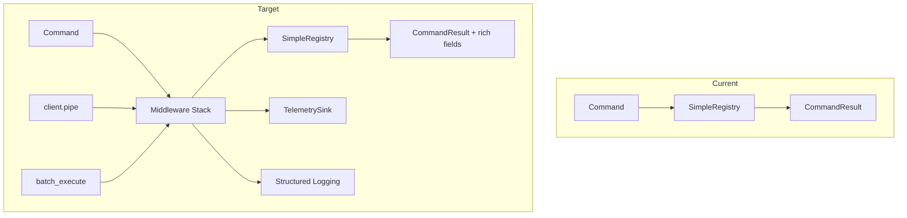

# AFD 0.6.0 Feature Adoption

> Incremental adoption of AFD 0.6.0 capabilities — middleware, telemetry, batch, streaming, testing helpers, pipelines, and richer CommandResult fields.

## Overview

Botcore upgraded from AFD 0.3.0 to 0.6.0. The upgrade is clean (386 tests pass), but botcore only uses basic AFD features: `CommandResult`, `success`, `error`, `DirectClient`, `SimpleRegistry`. AFD 0.6.0 shipped major capabilities that botcore should adopt to improve observability, developer experience, and agent UX.

This spec organizes adoption into seven prioritized, independently-implementable work items.

## Status

| Field | Value |
|---|---|
| Status | Active |
| Author | AI-assisted |
| Date | 2026-03-13 |
| Priority | Cross-cutting (improves DX, observability, agent UX) |

## Progress Snapshot

Implementation status as of 2026-03-21:

| Work Item | Status | Notes |
|---|---|---|
| P1 Testing Helpers | In Progress | Adopted across core, docs, middleware, registry, memory, llm, agents, pipeline, state, dev, portability, and analysis suites; manual `CommandResult` assertions are down to 69 repo-wide, with the biggest remaining hotspots in teams, spec, quality, and diagnostics tests |
| P2 Middleware Stack Integration | Complete | `MiddlewareRegistry`, default middleware wiring, plugin middleware integration, and dedicated tests are in place |
| P3 Telemetry Integration | Complete | Telemetry config and middleware wiring are implemented and covered by tests |
| P4 Richer CommandResult Fields | In Progress | `suggestions`, `confidence`, `sources`, and `reasoning` are in active use; undo metadata now exists for memory operations, but broader reversible-command adoption is still pending |
| P5 DirectClient Pipelines | In Progress | Pipeline support, docs, and tests exist, and `docs_preflight()` now uses `DirectClient.pipe()` in production code; broader adoption is still pending |
| P6 Batch Execution | Complete | `batch_execute()` helper and tests are implemented |
| P7 Streaming | Deferred | Still intentionally deferred pending a real transport/use-case |

## Problem

Botcore's AFD integration surface is minimal:

- **Tests** manually check `result.success` and `result.error.code` — no structural validation, poor failure messages
- **No middleware** — every command executes directly through `SimpleRegistry` with no cross-cutting concerns (tracing, timing, logging)
- **No telemetry** — command execution is invisible unless you add per-command logging
- **CommandResult fields unused** — `suggestions`, `confidence`, `sources`, `undo_command` exist on every result but are never populated
- **No pipelines** — multi-step orchestrator flows manually chain `client.call()` instead of using `client.pipe()` with variable resolution
- **No batch** — multi-agent task distribution executes commands one at a time

AFD 0.6.0 already provides solutions for all of these. Adoption is mechanical — no new abstractions needed.

## Architecture



## Implementation Sequence

```
P1 (Testing) ──────────────┐
                            ├── parallel, no dependencies
P4 (CommandResult fields) ──┘

P2 (Middleware) ───► P3 (Telemetry)    sequential

P5 (Pipelines) ─┐
                 ├── after P2 (soft dependency for observability)
P6 (Batch) ─────┘

P7 (Streaming) ─── deferred
```

---

## P1: Testing Helpers

> Lowest effort, highest ROI. Mechanical find-and-replace — no production code changes.

### Description

Replace manual assertions (`result.success`, `result.error.code`) with AFD's testing helpers. These provide better failure messages, structural validation, and consistent patterns across the test suite.

### Integration Pattern

```python
# Before
result = await client.call("info_workspace")
assert result.success is True
assert "workspace_root" in result.data

# After
from afd.testing import assert_success, assert_error, assert_has_reasoning

data = assert_success(result)  # raises with rich message on failure
assert "workspace_root" in data
```

### Available Helpers

| Helper | Replaces |
|--------|----------|
| `assert_success(result)` | `assert result.success is True` — also returns `result.data` |
| `assert_error(result, code=)` | `assert result.success is False; assert result.error.code == ...` |
| `assert_has_confidence(result, min=, max=)` | Manual confidence range checks |
| `assert_has_reasoning(result)` | `assert result.reasoning is not None` |
| `assert_has_sources(result, min_count=)` | Manual sources list length checks |
| `assert_has_suggestion(result)` | `assert result.error.suggestion is not None` |
| `assert_retryable(result)` | `assert result.error.retryable is True` |
| `validate_result(result, schema)` | Manual data shape checks |

### Files to Change

| File | Change |
|------|--------|
| `tests/test_commands.py` | Replace manual assertions |
| `tests/test_info.py` | Replace manual assertions |
| `tests/test_research.py` | Replace manual assertions |
| `tests/test_registry.py` | Replace manual assertions |
| All `tests/test_*.py` | Sweep remaining manual assertions |

### Value Delivered

- Failure messages include full result structure (not just `AssertionError: False is not True`)
- Structural validation catches shape regressions (e.g., missing `data` key)
- Consistent assertion pattern across all test files
- Start with core `tests/`, propagate to plugin packages in follow-up PRs

---

## P2: Middleware Stack Integration

> Most impactful production feature. Enables cross-cutting concerns without touching individual commands.

### Description

Wire AFD's `compose_middleware()` + `default_middleware()` into botcore's registry. Create a `MiddlewareRegistry` wrapper that implements the `DirectRegistry` protocol, delegates to `SimpleRegistry`, but wraps `execute()` through a middleware chain. Activate `PluginRegistry.add_middleware()` — currently a stub that collects middleware but never applies them.

### Integration Pattern

```python
# registry.py — new MiddlewareRegistry
from afd.server.middleware import compose_middleware, default_middleware

class MiddlewareRegistry:
    """DirectRegistry wrapper that applies middleware to every execute()."""

    def __init__(self, inner: SimpleRegistry):
        self._inner = inner
        self._middleware = default_middleware()  # trace_id + logging + timing

    def add_middleware(self, mw: Callable) -> None:
        self._middleware = compose_middleware(self._middleware, mw)

    async def execute(self, command: str, args: dict, context: dict | None = None) -> CommandResult:
        wrapped = self._middleware(self._inner.execute)
        return await wrapped(command, args, context)

    # Delegate remaining DirectRegistry methods to self._inner
    def register(self, *a, **kw): return self._inner.register(*a, **kw)
    def list_commands(self): return self._inner.list_commands()
    def has_command(self, name): return self._inner.has_command(name)
```

```python
# registry.py — update get_client()
def get_client(source: str | None = None, debug: bool = False) -> DirectClient:
    global _client
    if _client is None:
        mw_registry = MiddlewareRegistry(registry)
        # Apply plugin-registered middleware
        for mw in _plugin_middleware:
            mw_registry.add_middleware(mw)
        _client = create_direct_client(mw_registry, source, debug)
    return _client
```

```python
# plugin.py — activate add_middleware()
class PluginRegistry:
    def add_middleware(self, middleware: Callable[..., Any]) -> None:
        """Register middleware for the command execution pipeline."""
        self._middleware.append(middleware)
```

### Default Middleware Stack

`default_middleware()` provides out-of-the-box:
1. **Auto trace ID** — generates `context.trace_id` if not present
2. **Structured logging** — logs command name, args, result status
3. **Timing** — warns on commands exceeding threshold

### Files to Change

| File | Change |
|------|--------|
| `src/botcore/registry.py` | Add `MiddlewareRegistry`, update `get_client()` |
| `src/botcore/plugin.py` | Type-annotate `add_middleware()`, remove "not yet stabilized" comment |
| `tests/test_middleware.py` | **New** — test middleware composition, ordering, plugin registration |

### Value Delivered

- Every command gets trace ID, logging, and timing for free
- Plugins can inject custom middleware (rate limiting, caching, auth)
- `PluginRegistry.add_middleware()` becomes a real, documented API
- Foundation for P3 (Telemetry) and P5/P6 observability

---

## P3: Telemetry Integration

> Depends on P2. Adds structured telemetry recording to the middleware stack.

### Description

Add telemetry configuration to `BotCoreConfig`. When enabled, inject `create_telemetry_middleware(sink)` into the middleware stack. Start with `ConsoleTelemetrySink`, extensible to custom backends via the `TelemetrySink` protocol.

### Integration Pattern

```python
# config.py — add telemetry fields
class BotCoreConfig(BaseModel):
    # ... existing fields ...

    # Telemetry
    telemetry_enabled: bool = False
    telemetry_format: Literal["text", "json"] = "text"
```

```toml
# botcore.toml
[core]
telemetry_enabled = true
telemetry_format = "json"
```

```python
# registry.py — wire telemetry middleware
from afd.server.middleware import create_telemetry_middleware, ConsoleTelemetrySink

def get_client(source=None, debug=False) -> DirectClient:
    global _client
    if _client is None:
        mw_registry = MiddlewareRegistry(registry)
        config = get_current_config()
        if config.telemetry_enabled:
            sink = ConsoleTelemetrySink(format=config.telemetry_format)
            mw_registry.add_middleware(create_telemetry_middleware(sink))
        _client = create_direct_client(mw_registry, source, debug)
    return _client
```

### TelemetrySink Protocol

```python
# From afd.core.telemetry — extensible via protocol
class TelemetrySink(Protocol):
    async def record(self, event: TelemetryEvent) -> None: ...
    async def flush(self) -> None: ...
```

Custom backends (e.g., Azure Monitor, file-based) implement this protocol and are injected via plugin middleware.

### Files to Change

| File | Change |
|------|--------|
| `src/botcore/config.py` | Add `telemetry_enabled`, `telemetry_format` fields |
| `src/botcore/registry.py` | Wire `create_telemetry_middleware` when enabled |
| `tests/test_middleware.py` | Add telemetry middleware tests |

### Value Delivered

- Command execution becomes observable (command name, duration, success/failure, trace ID)
- `ConsoleTelemetrySink` works out of the box — no external dependencies
- JSON format ready for log aggregation (ELK, Azure Monitor, etc.)
- Plugin authors can provide custom sinks

---

## P4: Richer CommandResult Fields

> Parallel with P1. Populates existing CommandResult fields that are currently always empty.

### Description

AFD's `CommandResult` already has fields for `suggestions`, `confidence`, `sources`, `undo_command`, and `undo_args`. Botcore commands never populate them. This work item adds meaningful values where appropriate.

### Integration Pattern

```python
# commands/info.py — add suggestions to discovery commands
async def info_workspace() -> CommandResult[dict]:
    # ... existing logic ...
    return success(
        data={"workspace_root": str(root), "packages": packages, "package_count": len(packages)},
        suggestions=[
            "Use info_scripts to see available package scripts",
            "Use info_env for runtime environment details",
        ],
    )

async def info_env() -> CommandResult[dict]:
    # ... existing logic ...
    return success(
        data={"python_version": version, "platform": platform, "cwd": cwd},
        suggestions=["Use info_workspace for project structure"],
    )
```

```python
# commands/research.py — add confidence and sources
async def research_query(query: str, mode: str = "fast") -> CommandResult[dict]:
    # ... existing logic ...
    sources = _extract_sources(response)
    return success(
        data={"answer": answer, "query": query, "mode": mode, "model": model, "sources": sources},
        confidence=0.85 if sources else 0.5,  # Higher confidence when grounded
        sources=sources,
        reasoning=f"Searched via {model} in {mode} mode",
    )
```

```python
# Plugin commands — add undo support
async def agent_create(name: str, role: str, ...) -> CommandResult[dict]:
    # ... existing logic ...
    return success(
        data={"name": name, "status": "created"},
        undo_command="agent_delete",
        undo_args={"name": name},
    )

async def memory_set(key: str, value: str, scope: str) -> CommandResult[dict]:
    previous = await _get_existing(key, scope)
    return success(
        data={"key": key, "scope": scope},
        undo_command="memory_set" if previous else "memory_delete",
        undo_args={"key": key, "value": previous, "scope": scope} if previous else {"key": key, "scope": scope},
    )
```

### Field Adoption Map

| Field | Commands | Value |
|-------|----------|-------|
| `suggestions` | `info_workspace`, `info_env`, `info_scripts` | Guides agent to related commands |
| `confidence` | `research_query` | Signals result reliability to agents |
| `sources` | `research_query` | Provenance for grounded answers |
| `reasoning` | `research_query` | Explains search strategy |
| `undo_command` + `undo_args` | `agent_create`, `memory_set` | Enables undo/rollback workflows |

### Files to Change

| File | Change |
|------|--------|
| `src/botcore/commands/info.py` | Add `suggestions` to `info_workspace`, `info_env`, `info_scripts` |
| `src/botcore/commands/research.py` | Add `confidence`, `sources`, `reasoning` to `research_query` |
| Plugin command files | Add `undo_command`/`undo_args` where reversible |
| `tests/test_info.py` | Verify suggestions present |
| `tests/test_research.py` | Verify confidence/sources/reasoning |

### Value Delivered

- Agents get actionable next-step suggestions from discovery commands
- Research results carry confidence signals — agents can decide whether to retry or escalate
- Undo support enables rollback workflows without command-specific logic
- No new types — all fields already exist on `CommandResult`

---

## P5: DirectClient Pipelines

> After P2 (soft dependency for observability). Uses `client.pipe()` for multi-step flows.

### Description

`DirectClient.pipe()` is already available — it executes a sequence of commands with variable resolution (`$prev`, `$prev.field`, `$alias`). Orchestrator multi-step flows should use this instead of manual `client.call()` chains.

### Integration Pattern

```python
# Before — manual chaining in orchestrator
result1 = await client.call("info_workspace")
workspace = result1.data["workspace_root"]
result2 = await client.call("info_scripts", {"workspace": workspace})

# After — pipeline with variable resolution
from afd import PipelineStep

result = await client.pipe([
    PipelineStep(command="info_workspace", alias="ws"),
    PipelineStep(command="info_scripts", args={"workspace": "$ws.workspace_root"}),
])
# result.results contains both results; result.success is True if all succeeded
```

### Files to Change

| File | Change |
|------|--------|
| Orchestrator multi-step flows | Refactor to use `client.pipe()` |
| `src/botcore/commands/docs.py` | Add pipeline docs topic |
| `tests/test_pipeline.py` | **New** — test pipeline execution, variable resolution, error propagation |

### Value Delivered

- Multi-step flows are declarative and self-documenting
- Variable resolution eliminates manual result threading
- Pipeline failures include which step failed and why
- With P2 middleware, each pipeline step gets tracing/timing automatically

---

## P6: Batch Execution

> After P2 (soft dependency for observability). Enables parallel command execution.

### Description

`DirectClient` does not have a built-in `batch()` method. Implement `batch_execute()` in `registry.py` using AFD's `create_batch_request()` for request construction and sequential or parallel execution through the registry.

### Integration Pattern

```python
# registry.py — batch execution helper
from afd.core.batch import (
    BatchRequest, BatchResult, BatchCommand, BatchOptions,
    create_batch_request, create_batch_result,
)

async def batch_execute(
    client: DirectClient,
    commands: list[tuple[str, dict]],
    options: BatchOptions | None = None,
) -> BatchResult:
    """Execute multiple commands, returning partial-success semantics."""
    batch = create_batch_request([
        BatchCommand(command=cmd, args=args) for cmd, args in commands
    ])
    opts = options or BatchOptions()

    results = []
    for cmd in batch.commands:
        result = await client.call(cmd.command, cmd.args)
        results.append(result)
        if not result.success and opts.stop_on_error:
            break

    return create_batch_result(batch, results)
```

### Files to Change

| File | Change |
|------|--------|
| `src/botcore/registry.py` | Add `batch_execute()` helper |
| `tests/test_batch.py` | **New** — test batch execution, partial success, stop-on-error |

### Value Delivered

- Multi-agent task distribution can fan out commands efficiently
- Partial success semantics — batch continues on individual failures (configurable)
- `BatchResult` provides aggregated confidence and timing summary
- Foundation for parallel execution (future: `asyncio.gather` with `parallelism` option)

---

## P7: Streaming (Deferred)

> Document as future integration point. No implementation in this cycle.

### Description

AFD 0.6.0 includes streaming support. Most relevant for `llm_chat` and long research queries where incremental output improves UX. Deferred until MCP streaming transport support lands and a concrete use case emerges.

### Future Integration Points

- `llm_chat` — stream LLM responses token-by-token
- `research_query` — stream intermediate search results
- Long-running agent tasks — progress events during execution

---

## What NOT to Adopt

| Feature | Why Not |
|---------|---------|
| AFD Server Factory (`create_server()`) | Botcore's meta-tool pattern (3 tools) is deliberately more token-efficient than one-tool-per-command |
| AFD Handoff system | No use case for persistent bidirectional connections yet |
| AFD Connectors (`GitHubConnector`) | botcore-connectors has a more complete GitHub integration with audit logging |

## Risks

| Risk | Mitigation |
|------|------------|
| Middleware adds latency to every command | `default_middleware()` overhead is < 0.5ms per AFD benchmarks; measure in botcore's test suite |
| Telemetry logging is noisy | Off by default (`telemetry_enabled = false`); configurable format |
| Pipeline variable resolution hides data flow | Use pipelines only for well-defined multi-step sequences; keep complex flows explicit |
| Batch partial success confuses callers | `BatchResult.success` is `False` if any command failed; callers must check individual results |
| Testing helper API changes in future AFD versions | Pin assertions to current API; AFD testing module is stable |

## Migration

- All changes are additive — no breaking changes to existing behavior
- P1 (Testing) changes only test files — zero production impact
- P2 (Middleware) wraps existing registry — `SimpleRegistry` still does all real work
- P4 (CommandResult fields) adds optional fields — existing consumers ignore them
- Rollback path: remove `MiddlewareRegistry` wrapper, revert to direct `SimpleRegistry` usage
