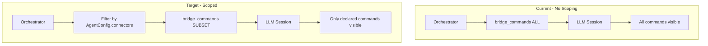

# Agent Capability Declarations

> Foundation spec — must be implemented before expanding agent or connector features.

## Overview

Agents currently have implicit access to all registered connectors. This spec adds explicit capability declarations to `AgentConfig` so the orchestrator restricts which connector commands each agent can use. Without this, every new connector is automatically available to every agent — making it impossible to enforce least-privilege.

## Status

| Field | Value |
|---|---|
| Status | Active |
| Author | AI-assisted |
| Date | 2026-02-26 |
| Priority | Foundation (blocks Phase 2 safely) |

## Problem

When `botcore-agents` creates an LLM session for an agent, `bridge_commands()` currently bridges **all** registered commands as Copilot tools. There's no mechanism to say "this agent should only see GitHub commands" or "this agent has no connector access."

This means:
- A research agent can call `github_create_issue` (unintended capability)
- A GitHub agent can call `memory_delete` on team scope (unintended access)
- Every new plugin's commands are immediately available to every agent (no opt-in)

The security model described in the connector spec (`04-security-model.spec.md`) specifies agent scoping, but the **orchestrator doesn't enforce it yet**.

## Architecture



## Contracts

### AgentConfig Changes

```python
class AgentConfig(BaseModel):
    """Extended with capability declarations."""
    name: str
    role: str | None = None
    model: str | None = None
    system_prompt: str | None = None
    max_retries: int = 3

    # NEW: Capability declarations
    connectors: list[str] | None = None
    """Connector prefixes this agent can use.
    None = all connectors (backwards-compatible default).
    Empty list = no connector access.
    Example: ["github", "memory"] → only github_* and memory_* commands bridged.
    """

    commands: list[str] | None = None
    """Explicit command allowlist (overrides connectors if set).
    None = use connector-based filtering.
    Example: ["github_list_issues", "github_get_issue"] → exact commands only.
    """
```

### Orchestrator Filtering

```python
# In AgentOrchestrator.start_agent():
async def start_agent(self, name: str) -> CommandResult[dict]:
    agent = self._agents[name]
    config = agent.config

    # Determine which commands to bridge
    if config.commands is not None:
        # Explicit allowlist — exact command names
        tool_names = config.commands
    elif config.connectors is not None:
        # Prefix-based filtering
        all_commands = self._namespace.keys()
        tool_names = [
            cmd for cmd in all_commands
            if any(cmd.startswith(f"{prefix}_") for prefix in config.connectors)
        ]
    else:
        # None = all commands (backwards-compatible)
        tool_names = list(self._namespace.keys())

    session = await llm_session_create(
        model=config.model,
        tools=tool_names,  # Only declared tools
        system_prompt=config.system_prompt,
    )
    # ...
```

### Config Example

```toml
# botcore.toml
[agents.researcher]
role = "research"
model = "claude-sonnet"
connectors = ["memory"]  # Can only use memory_* commands

[agents.github_bot]
role = "code"
connectors = ["github", "memory"]  # GitHub + memory

[agents.reviewer]
role = "review"
# connectors not set → all commands (backwards-compatible)
```

## Requirements

### Functional

- AgentConfig MUST accept optional `connectors: list[str] | None` field
- AgentConfig MUST accept optional `commands: list[str] | None` field
- `commands` (explicit allowlist) MUST take precedence over `connectors` (prefix filtering)
- When `connectors` is `None`, all commands MUST be bridged (backwards-compatible)
- When `connectors` is empty list `[]`, zero connector commands MUST be bridged
- Core commands (dev, skill, etc.) SHOULD be available to all agents regardless of connector setting
- Orchestrator MUST filter commands BEFORE passing to `bridge_commands()`

### Non-Functional

- Zero performance cost when `connectors` is `None` (no filtering pass)
- Config validation MUST reject unknown connector prefixes (warn, don't fail — prefix may come from uninstalled plugin)

## Testing

| Test | Assertion |
|------|-----------|
| Agent with `connectors: ["github"]` | Only `github_*` commands in session tools |
| Agent with `connectors: []` | Zero connector commands in session tools |
| Agent with `connectors: None` | All commands in session tools |
| Agent with `commands: ["github_list_issues"]` | Exactly one command in session tools |
| `commands` overrides `connectors` | `commands` wins when both set |
| Unknown connector prefix | Warning logged, no crash |

## Migration

- Existing configs without `connectors` field continue to work (None = all)
- No breaking changes to existing agent behavior
- New agents SHOULD declare connectors explicitly

## Risks

| Risk | Mitigation |
|------|------------|
| Existing agents break if default changes from None to [] | Default is None (all) — backwards-compatible |
| Plugin commands don't follow prefix convention | Validate prefix against registered commands, warn on orphans |
| Core commands accidentally filtered | Separate core commands from connector commands in filtering logic |
