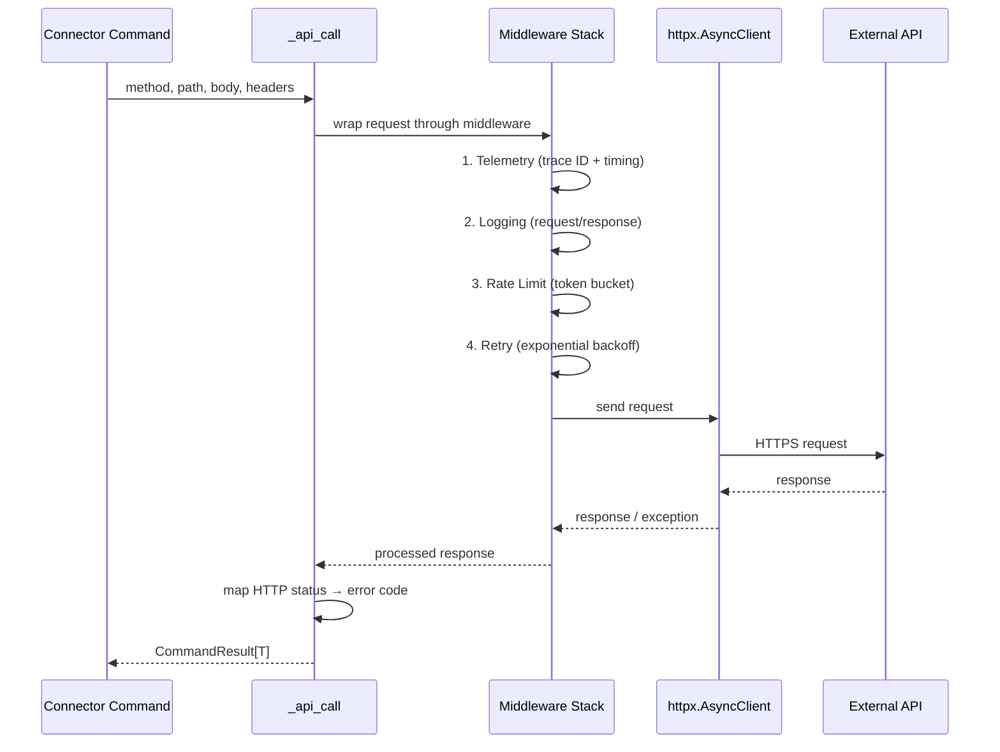
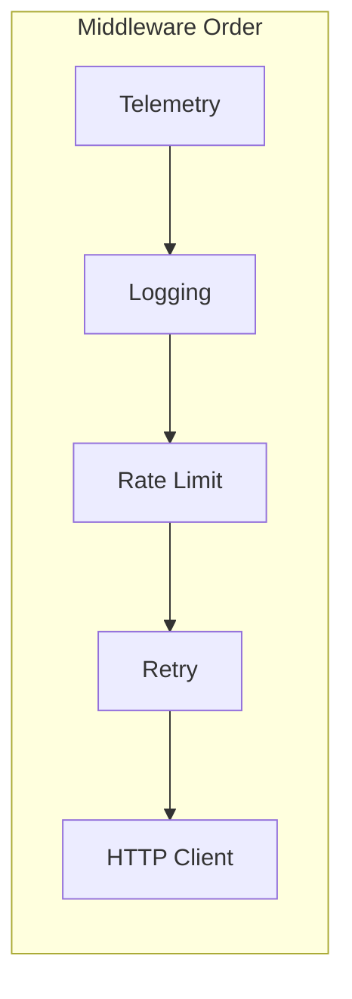

# Connector Base & Middleware Specification

> Part of [Typed Connectors Plan](./00-overview.plan.md)

## Overview

This spec defines the connector base layer: the `_api_call` protocol that every connector uses to make external HTTP requests, the middleware composition order, the HTTP-to-error-code mapping, retry semantics, and the response parsing contract that transforms raw API responses into `CommandResult` values. All connectors delegate their HTTP interactions through this shared base, ensuring consistent error handling, observability, and resilience across providers.

## Status

| Field | Value |
|---|---|
| Status | Complete |
| Author | AI-assisted |
| Date | 2026-02-26 |
| Completed | 2026-02-26 |
| Proposal | [00-overview.plan.md](./00-overview.plan.md) |

## Architecture





## Contracts

### ApiCallProtocol

```python
from typing import Any, Protocol, TypeVar
from botcore.commands import CommandResult

T = TypeVar("T")

class ApiCallProtocol(Protocol):
    async def __call__(
        self,
        method: str,
        path: str,
        *,
        json: dict[str, Any] | None = None,
        params: dict[str, str] | None = None,
        headers: dict[str, str] | None = None,
    ) -> CommandResult[dict[str, Any]]: ...
```

### ConnectorBase

```python
from typing import Any
from pydantic import BaseModel

class ConnectorContext(BaseModel):
    """Immutable context passed to every connector call."""
    base_url: str
    default_headers: dict[str, str] = {}
    timeout_seconds: float = 30.0
    max_retries: int = 3
    backoff_factor: float = 2.0
    rate_limit_rps: float = 10.0
```

### MiddlewareSignature

```python
from collections.abc import Callable, Awaitable
from typing import Any

# Middleware: wraps an inner handler, returns a new handler
MiddlewareFn = Callable[
    [Callable[..., Awaitable[Any]]],
    Callable[..., Awaitable[Any]],
]
```

## Requirements

### Functional

- `_api_call` MUST accept HTTP method, path, optional JSON body, query params, and headers
- `_api_call` MUST return `CommandResult[dict]` for all outcomes (success and error)
- `_api_call` MUST map HTTP status codes to error codes per the Error Handling table
- `_api_call` MUST compose middleware via `afd.middleware.compose_middleware()`
- `_api_call` MUST NOT raise exceptions to callers — all failures are `CommandResult` errors
- Every `CommandResult` error MUST include a `suggestion` string for LLM self-correction
- Middleware MUST execute in the order: telemetry → logging → rate limit → retry → HTTP
- Rate-limit middleware MUST execute before retry middleware to prevent retried requests from bypassing rate limits
- Retry middleware MUST only retry requests that receive retryable status codes (429, 502, 503, 504)
- Retry middleware MUST use exponential backoff with jitter
- Retry middleware SHOULD respect `Retry-After` headers when present
- Connectors MAY override `ConnectorContext` defaults for provider-specific tuning

### Non-Functional

- `_api_call` MUST resolve within `timeout_seconds` (default 30s) per attempt
- Middleware composition MUST add < 1ms overhead per call (excluding actual HTTP time)
- `_api_call` MUST propagate a trace ID via `X-Trace-Id` header for distributed tracing

## Error Handling

### HTTP Status → Error Code Mapping

| HTTP Status | Error Code | Condition | Recovery |
|---|---|---|---|
| 400 | `BAD_REQUEST` | Malformed request body or params | Fix request parameters per API docs |
| 401 | `AUTH_FAILED` | Missing or expired credentials | Re-authenticate; see [02-auth.spec.md](./02-auth.spec.md) |
| 403 | `FORBIDDEN` | Valid credentials but insufficient scope | Check required permissions for this operation |
| 404 | `NOT_FOUND` | Resource does not exist | Verify resource identifier (repo, ID, path) |
| 409 | `CONFLICT` | Resource state conflict (e.g., already exists) | Fetch current state and reconcile |
| 422 | `VALIDATION_ERROR` | API rejected input as semantically invalid | Review field values against API constraints |
| 429 | `RATE_LIMITED` | Rate limit exceeded (retryable) | Automatic retry via middleware; no user action needed |
| 500 | `SERVICE_ERROR` | Remote server error (retryable) | Automatic retry; if persistent, check service status |
| 502 | `SERVICE_ERROR` | Bad gateway (retryable) | Automatic retry; if persistent, check service status |
| 503 | `SERVICE_ERROR` | Service unavailable (retryable) | Automatic retry; if persistent, check service status |
| 504 | `SERVICE_ERROR` | Gateway timeout (retryable) | Automatic retry; if persistent, check service status |
| Other 4xx | `CLIENT_ERROR` | Unrecognized client error | Inspect response body for details |
| Other 5xx | `SERVICE_ERROR` | Unrecognized server error (retryable) | Automatic retry; if persistent, check service status |
| Network error | `NETWORK_ERROR` | Connection refused, DNS failure, timeout | Check network connectivity and service availability |

### Retryable Conditions

| Condition | Retryable | Max Retries | Backoff |
|---|---|---|---|
| HTTP 429 | Yes | 3 | Exponential (2s, 4s, 8s) + jitter, respect `Retry-After` |
| HTTP 5xx | Yes | 3 | Exponential (2s, 4s, 8s) + jitter |
| Network timeout | Yes | 2 | Exponential (1s, 2s) + jitter |
| Connection refused | Yes | 2 | Exponential (1s, 2s) + jitter |
| HTTP 4xx (not 429) | No | — | — |

## Configuration

| Key | Type | Default | Description |
|---|---|---|---|
| `timeout_seconds` | `float` | `30.0` | Per-attempt HTTP timeout |
| `max_retries` | `int` | `3` | Maximum retry attempts for retryable errors |
| `backoff_factor` | `float` | `2.0` | Exponential backoff multiplier |
| `rate_limit_rps` | `float` | `10.0` | Per-connector requests-per-second ceiling |
| `jitter_max_seconds` | `float` | `1.0` | Maximum random jitter added to backoff |

## Task Breakdown

### Wave 1: Core Protocol

- [ ] Define `ConnectorContext` Pydantic model — acceptance: model validates with defaults, rejects negative timeouts
- [ ] Define `ApiCallProtocol` type — acceptance: type-checks against a mock implementation
- [ ] Implement `_api_call` using `httpx.AsyncClient` and `afd.compose_middleware()` — acceptance: makes HTTP request through middleware stack

### Wave 2: Error Mapping

- [ ] Implement HTTP status → error code mapping — acceptance: every status in the table maps to the correct code
- [ ] Add `suggestion` strings to all error codes — acceptance: every error `CommandResult` has a non-empty `suggestion`
- [ ] Handle network errors (timeout, connection refused) — acceptance: network failures return `NETWORK_ERROR`, not raised exceptions

### Wave 3: Retry & Rate Limiting

- [ ] Configure retry middleware with exponential backoff + jitter — acceptance: 429/5xx retried up to `max_retries`, 4xx not retried
- [ ] Implement `Retry-After` header respect — acceptance: when header present, backoff uses header value instead of calculated delay
- [ ] Configure rate-limit middleware — acceptance: requests exceeding `rate_limit_rps` are queued, not dropped

### Wave 4: Telemetry & Observability

- [ ] Add trace ID propagation (`X-Trace-Id` header) — acceptance: every outbound request carries a unique trace ID
- [ ] Wire telemetry middleware for timing and error-rate metrics — acceptance: `TelemetryEvent` emitted per call with latency and status

## Acceptance Criteria

- [ ] `_api_call("GET", "/test")` returns `CommandResult` with success data on HTTP 200
- [ ] `_api_call("POST", "/fail")` returns `CommandResult` error with correct error code for each HTTP status in the mapping table
- [ ] Retryable errors (429, 5xx) are retried up to `max_retries` times with exponential backoff
- [ ] Non-retryable errors (4xx except 429) are returned immediately without retry
- [ ] Rate limiting queues excess requests rather than dropping them
- [ ] Middleware executes in the specified order (telemetry → logging → rate limit → retry → HTTP)
- [ ] All `CommandResult` errors include a `suggestion` field
- [ ] No exceptions propagate to callers — all failures are `CommandResult` values
- [ ] Network errors (timeout, DNS, connection refused) produce `NETWORK_ERROR` results

## Rollback Plan

The connector base is a new package (`botcore-connectors`) with no existing callers. Rollback is:

1. Remove the `botcore-connectors` package from the workspace
2. Remove any `botcore.plugins` entry-point registration
3. No existing botcore functionality is affected — connectors are purely additive
