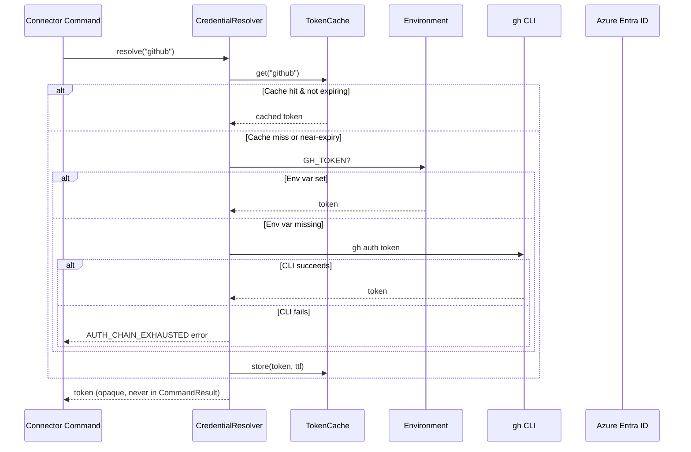

# Auth & Credential Resolution Specification

> Part of [Typed Connectors Plan](./00-overview.plan.md)

## Overview

This spec defines how connectors resolve credentials for external API calls. Each provider has an ordered credential resolution chain with explicit fallback semantics. Tokens are resolved server-side and MUST never appear in tool arguments, `CommandResult` values, configuration files, or log output. The auth layer handles token caching, refresh-before-expiry, and produces structured error codes when all resolution strategies are exhausted.

## Status

| Field | Value |
|---|---|
| Status | Draft |
| Author | AI-assisted |
| Date | 2026-02-26 |
| Proposal | [00-overview.plan.md](./00-overview.plan.md) |

## Architecture

```mermaid
graph TD
    subgraph GitHub Chain
        G1[GH_TOKEN env var] -->|missing| G2[gh auth token CLI]
        G2 -->|fails| G3[GITHUB_AUTH_MISSING error]
    end

    subgraph Azure Chain
        A1[AZURE_* env vars] -->|missing| A2[Managed Identity]
        A2 -->|unavailable| A3[Azure CLI az account get-access-token]
        A3 -->|fails| A4[AZURE_AUTH_CHAIN_EXHAUSTED error]
    end

    subgraph Graph Chain
        M1[Cached token] -->|expired| M2[Client credentials]
        M2 -->|unavailable| M3[Device code flow]
        M3 -->|expired/denied| M4[ENTRA_DEVICE_CODE_EXPIRED error]
    end
```





## Contracts

### CredentialResolver Protocol

```python
from typing import Protocol

class CredentialResolver(Protocol):
    async def resolve(self, provider: str) -> str:
        """Resolve a bearer token for the given provider.

        Returns the token string. Raises no exceptions —
        returns empty string on failure (callers check via
        auth error in _api_call).
        """
        ...

    async def invalidate(self, provider: str) -> None:
        """Remove cached credentials for a provider."""
        ...
```

### TokenCacheEntry

```python
from pydantic import BaseModel
from datetime import datetime

class TokenCacheEntry(BaseModel):
    token: str  # excluded from repr/serialization
    provider: str
    expires_at: datetime | None
    refresh_threshold_seconds: float = 300.0
```

### AuthConfig

```python
from pydantic import BaseModel

class AuthConfig(BaseModel):
    """Per-provider auth overrides in connector config."""
    github_token_env: str = "GH_TOKEN"
    azure_managed_identity_client_id: str | None = None
    graph_tenant_id: str | None = None
    graph_client_id: str | None = None
    token_cache_ttl_seconds: float = 3600.0
    refresh_before_expiry_seconds: float = 300.0
```

## Requirements

### Functional

- The auth layer MUST resolve credentials through an ordered chain per provider
- If all strategies in a chain fail, the resolver MUST return a structured error code (not raise)
- The resolver MUST cache tokens and reuse them until near-expiry
- The resolver MUST refresh tokens when remaining TTL falls below `refresh_before_expiry_seconds`
- The resolver MUST support an `invalidate()` method to force re-resolution (e.g., after 401)
- `_api_call` ([01-connector-base.spec.md](./01-connector-base.spec.md)) MUST call `invalidate()` and retry once on HTTP 401 before returning `AUTH_FAILED`

### Credential Chains

- **GitHub** MUST resolve in order: `GH_TOKEN` env var → `gh auth token` CLI fallback
- **Azure** MUST resolve via `DefaultAzureCredential` chain: env vars → managed identity → Azure CLI
- **Microsoft Graph** MUST resolve in order: cached token → client credentials → device code flow

### Security Invariants

- Tokens MUST NOT appear in `CommandResult` data, metadata, or reasoning fields
- Tokens MUST NOT appear in tool argument schemas or tool call results
- Tokens MUST NOT be logged at any log level — log sanitization MUST redact bearer tokens
- Tokens MUST NOT appear in botcore.toml, agent config, or any persisted configuration
- `TokenCacheEntry.token` MUST be excluded from Pydantic `.model_dump()` and `repr()`
- Log sanitization MUST redact any string matching `Bearer <token>`, `token=<value>`, or `Authorization: <value>` patterns

### Non-Functional

- Token resolution MUST complete within 5 seconds for env-var and cache-hit paths
- Device code flow MAY take up to 120 seconds (interactive user approval)
- Token cache MUST be in-memory only — no persistence to disk

## Error Handling

| Error Code | Condition | Recovery |
|---|---|---|
| `GITHUB_AUTH_MISSING` | GH_TOKEN unset and `gh auth token` failed | Set GH_TOKEN env variable or run `gh auth login` |
| `AZURE_AUTH_CHAIN_EXHAUSTED` | All DefaultAzureCredential strategies failed | Set AZURE_CLIENT_ID/SECRET/TENANT env vars, enable managed identity, or run `az login` |
| `ENTRA_DEVICE_CODE_EXPIRED` | Device code flow timed out or was denied | Re-initiate auth flow; ensure user approves within 15 minutes |
| `ENTRA_SCOPE_INSUFFICIENT` | Token lacks required Graph permission scope | Request additional scopes via admin consent or app registration |
| `AUTH_REFRESH_FAILED` | Token refresh attempted but failed | Invalidate cache and re-authenticate from scratch |
| `AUTH_FAILED` | 401 response after retry with fresh credentials | Verify credentials are valid and have required permissions |

## Configuration

| Key | Type | Default | Description |
|---|---|---|---|
| `auth.github_token_env` | `str` | `"GH_TOKEN"` | Env var name for GitHub PAT |
| `auth.azure_managed_identity_client_id` | `str \| None` | `None` | Client ID for user-assigned managed identity |
| `auth.graph_tenant_id` | `str \| None` | `None` | Azure AD tenant for Graph auth |
| `auth.graph_client_id` | `str \| None` | `None` | App registration client ID for Graph |
| `auth.token_cache_ttl_seconds` | `float` | `3600.0` | Default cache TTL when token has no explicit expiry |
| `auth.refresh_before_expiry_seconds` | `float` | `300.0` | Refresh token when this many seconds remain before expiry |

## Task Breakdown

### Wave 1: GitHub Auth

- [ ] Implement GitHub credential chain (env var → CLI fallback) — acceptance: resolves token from GH_TOKEN; falls back to `gh auth token`; returns `GITHUB_AUTH_MISSING` when both fail
- [ ] Implement in-memory token cache with TTL — acceptance: second resolve() call returns cached token without re-reading env; cache expires after TTL
- [ ] Implement `invalidate()` method — acceptance: after invalidate, next resolve() re-reads from source

### Wave 2: Azure Auth

- [ ] Integrate `DefaultAzureCredential` chain — acceptance: resolves token via env vars, managed identity, or Azure CLI in order
- [ ] Return `AZURE_AUTH_CHAIN_EXHAUSTED` on full chain failure — acceptance: structured error with setup suggestion

### Wave 3: Graph Auth

- [ ] Implement client credentials flow — acceptance: resolves token for app-only Graph permissions
- [ ] Implement device code flow with timeout — acceptance: prompts user, returns token on approval, returns `ENTRA_DEVICE_CODE_EXPIRED` on timeout
- [ ] Implement scope validation — acceptance: returns `ENTRA_SCOPE_INSUFFICIENT` when token lacks required permission

### Wave 4: Security Hardening

- [ ] Implement log sanitization for bearer tokens — acceptance: `Bearer <token>` patterns redacted in all log output
- [ ] Exclude token from Pydantic serialization — acceptance: `TokenCacheEntry.model_dump()` omits `token` field
- [ ] Verify tokens never appear in CommandResult — acceptance: integration test confirms no token leakage in success/error results

## Acceptance Criteria

- [ ] GitHub auth resolves from `GH_TOKEN` env var when set
- [ ] GitHub auth falls back to `gh auth token` when env var is unset
- [ ] GitHub auth returns `GITHUB_AUTH_MISSING` error when both strategies fail
- [ ] Token cache returns cached token on second call within TTL
- [ ] Token cache triggers refresh when remaining TTL < `refresh_before_expiry_seconds`
- [ ] `invalidate()` forces re-resolution on next `resolve()` call
- [ ] Tokens never appear in `CommandResult` data or reasoning
- [ ] Tokens never appear in log output at any level
- [ ] `TokenCacheEntry.model_dump()` and `repr()` omit the token field
- [ ] Azure auth uses `DefaultAzureCredential` chain ordering
- [ ] Graph device code flow times out with `ENTRA_DEVICE_CODE_EXPIRED` after expiry

## Rollback Plan

Auth is internal to `botcore-connectors` with no external API surface:

1. Auth failures already produce structured errors — connectors degrade gracefully
2. Remove auth module and its tests from the package
3. No other botcore components depend on the auth layer
