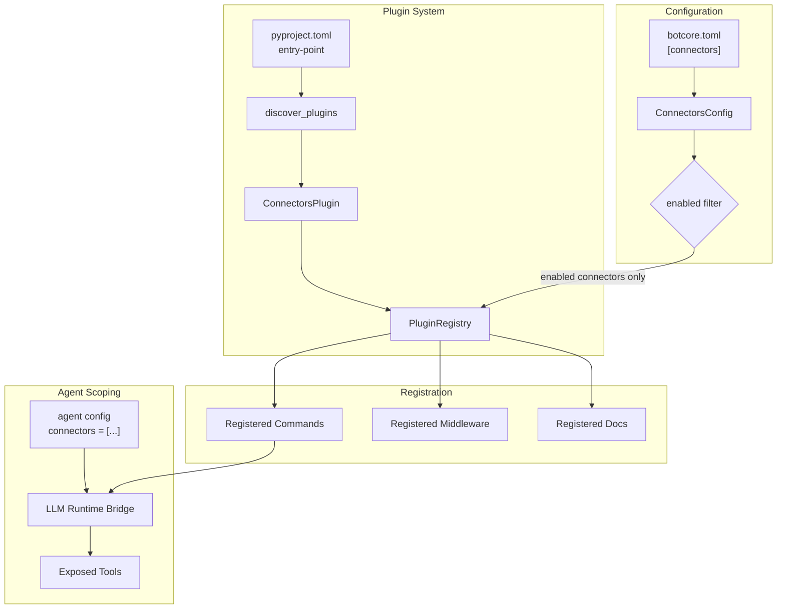
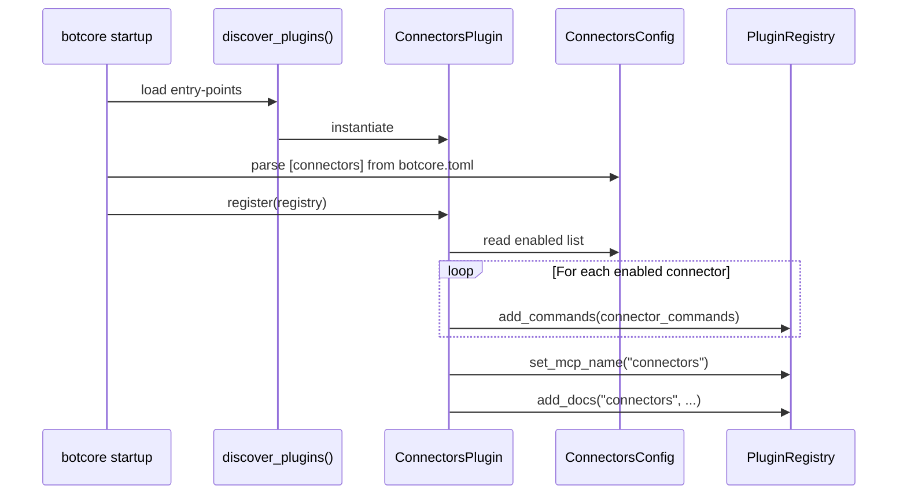

# Config Schema & Plugin Registration Specification

> Part of [Typed Connectors Plan](./00-overview.plan.md)

## Overview

This spec defines the `ConnectorsConfig` Pydantic model, the `[connectors]` section of botcore.toml, the `enabled` filtering mechanism that controls which connectors are loaded, the agent-scoping interaction, and the plugin registration wiring via `pyproject.toml` entry-points. It bridges the connector base ([01](./01-connector-base.spec.md)) and auth ([02](./02-auth.spec.md)) into the botcore plugin system defined in `src/botcore/plugin.py`.

## Status

| Field | Value |
|---|---|
| Status | Complete |
| Author | AI-assisted |
| Date | 2026-02-26 |
| Completed | 2026-02-26 |
| Proposal | [00-overview.plan.md](./00-overview.plan.md) |

## Architecture





## Contracts

### ConnectorsConfig

```python
from pydantic import BaseModel

class GitHubConnectorConfig(BaseModel):
    default_repo: str | None = None
    api_version: str = "2022-11-28"

class AzureBlobConfig(BaseModel):
    account_name: str | None = None
    container: str | None = None

class AzureQueueConfig(BaseModel):
    namespace: str | None = None
    queue_name: str | None = None

class EmailConfig(BaseModel):
    from_address: str | None = None

class ConnectorsConfig(BaseModel):
    enabled: list[str] = []
    github: GitHubConnectorConfig = GitHubConnectorConfig()
    azure_blob: AzureBlobConfig = AzureBlobConfig()
    azure_queue: AzureQueueConfig = AzureQueueConfig()
    email: EmailConfig = EmailConfig()
    auth: AuthConfig = AuthConfig()  # from 02-auth.spec.md
```

### ConnectorsPlugin

```python
from botcore.plugin import BotCorePlugin, PluginRegistry
from pydantic import BaseModel

class ConnectorsPlugin(BotCorePlugin):
    def register(self, registry: PluginRegistry) -> None: ...
    def config_schema(self) -> type[BaseModel] | None: ...
```

### Entry-Point Declaration

```toml
# botcore-connectors/pyproject.toml
[project.entry-points."botcore.plugins"]
connectors = "botcore_connectors:ConnectorsPlugin"
```

## Requirements

### Functional

- `ConnectorsConfig` MUST be a Pydantic `BaseModel` validated from the `[connectors]` section of botcore.toml
- `ConnectorsConfig.enabled` MUST be a list of connector name strings (e.g., `["github", "azure_blob"]`)
- If `enabled` is empty, no connector commands MUST be registered
- If `enabled` contains an unrecognized connector name, startup MUST raise a `ValidationError` with the invalid name
- `ConnectorsPlugin.register()` MUST only register commands for connectors in the `enabled` list
- `ConnectorsPlugin.config_schema()` MUST return `ConnectorsConfig`
- The plugin MUST register via the `botcore.plugins` entry-point group in `pyproject.toml`
- Per-connector config sections (e.g., `[connectors.github]`) SHOULD be validated only for enabled connectors
- The plugin MUST call `registry.set_mcp_name("connectors")` during registration
- The plugin MUST call `registry.add_docs()` with connector documentation

### Agent Scoping Interaction

- Agent-level `connectors = [...]` config MUST restrict which connector tools are exposed via the LLM Runtime bridge
- If an agent declares `connectors = ["github"]`, only `github_*` commands MUST be available as tools
- Agent scoping is enforced by the LLM Runtime bridge, not by this plugin — this spec documents the contract
- This plugin SHOULD expose a method to list registered connector prefixes for the bridge to filter against

### Package Structure

- The package MUST be named `botcore-connectors`
- The package MUST declare `botcore` and `httpx` as required dependencies
- Provider-specific dependencies MUST be in optional-dependency groups: `github`, `azure`, `graph`
- The `azure` group MUST include `azure-identity`, `azure-storage-blob`, `azure-servicebus`
- The `graph` group MUST include `msgraph-sdk`

## Error Handling

| Error Code | Condition | Recovery |
|---|---|---|
| `CONFIG_INVALID_CONNECTOR` | `enabled` list contains unrecognized connector name | Fix the connector name in botcore.toml `[connectors].enabled` |
| `CONFIG_MISSING_REQUIRED` | Enabled connector requires config that is absent (e.g., `azure_blob` without `account_name`) | Add the required config keys under `[connectors.<name>]` |
| `PLUGIN_LOAD_FAILED` | Entry-point resolution failed (import error, missing dependency) | Install the required optional-dependency group: `pip install botcore-connectors[azure]` |

## Configuration

### botcore.toml Schema

| Key | Type | Default | Description |
|---|---|---|---|
| `connectors.enabled` | `list[str]` | `[]` | Connector names to load; empty = no connectors |
| `connectors.github.default_repo` | `str \| None` | `None` | Default `owner/repo` for GitHub commands |
| `connectors.github.api_version` | `str` | `"2022-11-28"` | GitHub API version header |
| `connectors.azure_blob.account_name` | `str \| None` | `None` | Azure Storage account name |
| `connectors.azure_blob.container` | `str \| None` | `None` | Default blob container |
| `connectors.azure_queue.namespace` | `str \| None` | `None` | Service Bus namespace |
| `connectors.azure_queue.queue_name` | `str \| None` | `None` | Default queue name |
| `connectors.email.from_address` | `str \| None` | `None` | Default sender for outbound email |
| `connectors.auth.*` | — | — | See [02-auth.spec.md](./02-auth.spec.md) |

### pyproject.toml Package Definition

| Key | Type | Description |
|---|---|---|
| `project.name` | `str` | `"botcore-connectors"` |
| `project.dependencies` | `list[str]` | `["botcore", "httpx", "afd"]` |
| `project.optional-dependencies.github` | `list[str]` | `[]` (gh CLI only) |
| `project.optional-dependencies.azure` | `list[str]` | `["azure-identity", "azure-storage-blob", "azure-servicebus"]` |
| `project.optional-dependencies.graph` | `list[str]` | `["msgraph-sdk"]` |

## Task Breakdown

### Wave 1: Package Scaffold

- [ ] Create `botcore-connectors/pyproject.toml` with entry-point and dependency groups — acceptance: `pip install -e .` succeeds; entry-point resolves via `importlib.metadata`
- [ ] Create `botcore_connectors/__init__.py` with `ConnectorsPlugin` class — acceptance: `discover_plugins()` finds and instantiates the plugin

### Wave 2: Config Model

- [ ] Define `ConnectorsConfig` and per-connector sub-models — acceptance: validates a well-formed `[connectors]` TOML section; rejects unknown connector names in `enabled`
- [ ] Wire `config_schema()` to return `ConnectorsConfig` — acceptance: botcore config loader picks up and validates the connector config section

### Wave 3: Registration Logic

- [ ] Implement `register()` with `enabled` filtering — acceptance: only commands for connectors in `enabled` are added to registry; empty `enabled` registers zero commands
- [ ] Register MCP name and docs — acceptance: `registry.mcp_name == "connectors"` and docs topic is populated
- [ ] Expose connector prefix listing for agent scoping — acceptance: bridge can query which prefixes are registered

### Wave 4: Validation & Error Paths

- [ ] Validate `enabled` entries against known connector names — acceptance: `ValidationError` raised for `enabled = ["nonexistent"]`
- [ ] Validate required per-connector config for enabled connectors — acceptance: enabling `azure_blob` without `account_name` produces `CONFIG_MISSING_REQUIRED`
- [ ] Graceful handling of missing optional dependencies — acceptance: enabling `azure_blob` without `azure` extras installed produces `PLUGIN_LOAD_FAILED` with install suggestion

## Acceptance Criteria

- [ ] `pip install -e botcore-connectors` succeeds and registers the entry-point
- [ ] `discover_plugins()` returns `ConnectorsPlugin` instance under `"connectors"` key
- [ ] `ConnectorsConfig(enabled=["github"])` validates successfully
- [ ] `ConnectorsConfig(enabled=["nonexistent"])` raises `ValidationError`
- [ ] `register()` with `enabled=["github"]` adds only `github_*` commands to the registry
- [ ] `register()` with `enabled=[]` adds zero commands
- [ ] `config_schema()` returns `ConnectorsConfig` class
- [ ] Agent scoping: bridge can filter tools by connector prefix against registered prefixes

## Rollback Plan

1. Remove `botcore-connectors` package directory
2. Remove from workspace `pyproject.toml` dependencies (if added)
3. `discover_plugins()` returns empty dict — no connector functionality loaded
4. Existing botcore functionality is unaffected
