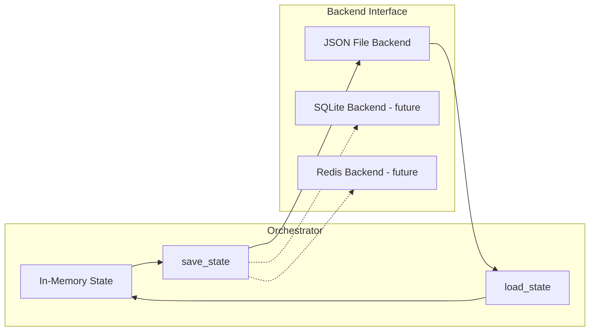

# Orchestrator State Serialization

> Foundation spec — must be implemented before adding distributed or persistent orchestration.

## Overview

The `AgentOrchestrator` currently holds all state in memory — agent pool, task queue, health snapshots. When the MCP session ends, everything is lost. This spec adds a serialization interface (`save_state()` / `load_state()`) so orchestrator state can be persisted and restored. The initial implementation uses JSON files; the interface enables future backends (SQLite, Redis) without rewriting the orchestrator.

## Status

| Field | Value |
|---|---|
| Status | Active |
| Author | AI-assisted |
| Date | 2026-02-26 |
| Priority | Foundation (blocks persistent orchestration) |

## Problem

Current limitations:
- MCP session ends → all agents, tasks, and health history vanish
- No crash recovery — if the process restarts, orchestrator starts empty
- No handoff — can't transfer agent pool between processes
- No inspection — external tools can't read orchestrator state from disk

These don't matter for ephemeral dev-mode usage. They block:
- **Server mode** — persistent orchestrator on a VM
- **CI mode** — resume from checkpoint after pipeline stage
- **Dashboard** — external process reads orchestrator state for visualization
- **Distributed orchestration** — multiple processes share state via backend

## Architecture



## Contracts

### StateBackend Protocol

```python
from typing import Protocol, Any

class OrchestratorStateBackend(Protocol):
    """Interface for orchestrator state persistence."""

    async def save(self, state: dict[str, Any]) -> None:
        """Persist orchestrator state snapshot."""
        ...

    async def load(self) -> dict[str, Any] | None:
        """Load last saved state. Returns None if no state exists."""
        ...

    async def clear(self) -> None:
        """Remove persisted state."""
        ...
```

### JSON File Backend (Initial Implementation)

```python
import json
from pathlib import Path

class JsonStateBackend:
    """Simple JSON file backend for orchestrator state."""

    def __init__(self, path: Path):
        self._path = path

    async def save(self, state: dict[str, Any]) -> None:
        self._path.parent.mkdir(parents=True, exist_ok=True)
        self._path.write_text(json.dumps(state, default=str, indent=2))

    async def load(self) -> dict[str, Any] | None:
        if not self._path.exists():
            return None
        return json.loads(self._path.read_text())

    async def clear(self) -> None:
        self._path.unlink(missing_ok=True)
```

### Orchestrator State Shape

```python
class OrchestratorSnapshot(BaseModel):
    """Serializable orchestrator state."""
    version: int = 1
    timestamp: str  # ISO 8601
    agents: dict[str, AgentSnapshot]
    tasks: dict[str, TaskSnapshot]
    config: dict[str, Any]  # AgentConfig per agent

class AgentSnapshot(BaseModel):
    """Agent state minus the live session."""
    name: str
    status: str  # stopped, idle, busy, error
    tasks_completed: int
    tasks_failed: int
    created_at: str
    last_heartbeat: str | None
    # session_id intentionally excluded — sessions aren't portable

class TaskSnapshot(BaseModel):
    """Task state for persistence."""
    task_id: str
    description: str
    status: str  # pending, assigned, running, completed, failed, cancelled
    assigned_to: str | None
    priority: int
    created_at: str
    completed_at: str | None
    result_summary: str | None
```

### Orchestrator API Additions

```python
class AgentOrchestrator:
    def __init__(self, config, backend: OrchestratorStateBackend | None = None):
        self._backend = backend
        # ...

    async def save_state(self) -> CommandResult[dict]:
        """Serialize current state to backend."""
        if not self._backend:
            return error("NO_BACKEND", "No state backend configured",
                        suggestion="Pass a backend to AgentOrchestrator()")
        snapshot = self._build_snapshot()
        await self._backend.save(snapshot.model_dump())
        return success({"agents": len(snapshot.agents), "tasks": len(snapshot.tasks)})

    async def load_state(self) -> CommandResult[dict]:
        """Restore state from backend. Does NOT restore live sessions."""
        if not self._backend:
            return error("NO_BACKEND", "No state backend configured",
                        suggestion="Pass a backend to AgentOrchestrator()")
        data = await self._backend.load()
        if data is None:
            return error("NO_STATE", "No saved state found",
                        suggestion="Call save_state() first")
        snapshot = OrchestratorSnapshot.model_validate(data)
        self._restore_from_snapshot(snapshot)
        return success({
            "agents_restored": len(snapshot.agents),
            "tasks_restored": len(snapshot.tasks),
            "note": "Live sessions not restored — call start_agent() to reconnect"
        })
```

## Requirements

### Functional

- AgentOrchestrator MUST accept an optional `backend` parameter (default: None, in-memory only)
- `save_state()` MUST serialize all agent configs, health, and task state
- `save_state()` MUST NOT serialize live LLM session references (not portable)
- `load_state()` MUST restore agent state as `stopped` (sessions must be re-created)
- `load_state()` MUST restore pending/assigned tasks (can be re-assigned)
- `load_state()` MUST skip completed/failed/cancelled tasks older than configurable retention
- Snapshot MUST include a `version` field for future schema migration
- State shape MUST be JSON-serializable (no custom types without `default=str`)
- `save_state()` and `load_state()` MUST return CommandResult

### Non-Functional

- JSON backend write MUST be atomic (write to temp file, rename)
- No performance impact when backend is None (zero-cost opt-in)
- Snapshot SHOULD be human-readable (indented JSON)

## Testing

| Test | Assertion |
|------|-----------|
| save_state() with no backend | Returns error with NO_BACKEND code |
| save → load roundtrip | Agent configs, health counters, task state preserved |
| Loaded agents start as stopped | No live sessions after load |
| Pending tasks survive roundtrip | Task can be re-assigned after load |
| Completed tasks excluded by retention | Old completed tasks not loaded |
| Version field present | Snapshot includes version for migration |
| Atomic write | Incomplete write doesn't corrupt existing state |

## Migration

- AgentOrchestrator() without backend continues to work (no persistence)
- No breaking changes to existing API
- New optional parameter only

## Risks

| Risk | Mitigation |
|------|------------|
| State file corruption | Atomic writes (temp + rename); version field for migration |
| State diverges from reality (stale) | Auto-save on state transitions; note in load_state result |
| Large state files | Retention policy for completed tasks; configurable max |
