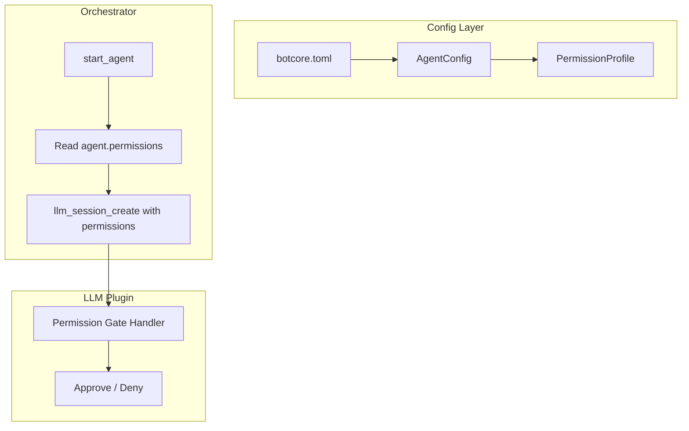

# Per-Agent Permission Profiles

> Foundation spec — must be implemented before adding new agent types or deployment modes.

## Overview

Permission gates (`allow_shell`, `allow_filesystem`, `allow_mcp`, `allow_custom_tools`) currently live in `botcore-llm` at the session level. This spec moves them to `AgentConfig` so each agent has a declared permission profile that the orchestrator applies when creating its LLM session. Without this, every agent gets the same permission profile regardless of role.

## Status

| Field | Value |
|---|---|
| Status | Active |
| Author | AI-assisted |
| Date | 2026-02-26 |
| Priority | Foundation (blocks safe multi-agent deployment) |

## Problem

Current state in `botcore-llm/permissions.py`:
- Permission gates are per-session configuration
- The orchestrator creates sessions without specifying permissions
- All agents get the same default permission set
- No way to say "the researcher can't use shell, but the coder can"

This means:
- A research agent that should only search the web can execute shell commands
- A code review agent that should only read files can write to filesystem
- Permission profiles can't be declared in config — they're runtime-only

## Architecture



## Contracts

### PermissionProfile Model

```python
class PermissionProfile(BaseModel):
    """Declares what a specific agent is allowed to do."""
    allow_shell: bool = False
    allow_filesystem: bool = False
    allow_mcp: bool = True
    allow_custom_tools: bool = True

    shell_allowlist: list[str] | None = None
    """If allow_shell is True, restrict to these patterns.
    Example: ["git *", "pytest *", "ruff *"]
    None = all shell commands (when allow_shell is True).
    """

    filesystem_paths: list[str] | None = None
    """If allow_filesystem is True, restrict to these path prefixes.
    Example: ["./src", "./tests"]
    None = all paths (when allow_filesystem is True).
    """
```

### AgentConfig Extension

```python
class AgentConfig(BaseModel):
    name: str
    role: str | None = None
    model: str | None = None
    system_prompt: str | None = None
    max_retries: int = 3
    connectors: list[str] | None = None  # From capability declarations spec

    # NEW: Permission profile
    permissions: PermissionProfile = PermissionProfile()
    """Permission profile for this agent.
    Defaults: shell=False, filesystem=False, mcp=True, custom_tools=True.
    """
```

### Config Example

```toml
# botcore.toml

[agents.researcher]
role = "research"
connectors = ["memory"]
[agents.researcher.permissions]
allow_shell = false
allow_filesystem = false

[agents.coder]
role = "code"
connectors = ["github", "memory"]
[agents.coder.permissions]
allow_shell = true
shell_allowlist = ["git *", "pytest *", "ruff *"]
allow_filesystem = true
filesystem_paths = ["./src", "./tests"]

[agents.reviewer]
role = "review"
connectors = ["github"]
# permissions defaults: no shell, no filesystem
```

### Orchestrator Integration

```python
# In AgentOrchestrator.start_agent():
async def start_agent(self, name: str) -> CommandResult[dict]:
    agent = self._agents[name]
    config = agent.config

    session = await llm_session_create(
        model=config.model,
        tools=self._filter_tools(config),
        system_prompt=config.system_prompt,
        permissions=config.permissions,  # NEW: pass permission profile
    )
    # ...
```

### LLM Session Changes

```python
# In llm_session_create():
async def llm_session_create(
    model: str | None = None,
    tools: list[str] | None = None,
    system_prompt: str | None = None,
    streaming: bool = True,
    permissions: PermissionProfile | None = None,  # NEW
) -> CommandResult[dict]:
    # Store permissions in session entry
    # Permission gate handler reads from session entry
    ...
```

### Permission Gate Handler Update

```python
# Current: reads from global config
# Target: reads from session-specific permissions

def _create_permission_handler(session_id: str):
    def on_permission_request(kind: str, params: dict) -> dict:
        session = session_registry.get(session_id)
        perms = session.permissions  # NEW: per-session permissions

        if kind == "shell":
            if not perms.allow_shell:
                return {"kind": "denied-by-rules"}
            if perms.shell_allowlist is not None:
                cmd = params.get("command", "")
                if not _matches_allowlist(cmd, perms.shell_allowlist):
                    return {"kind": "denied-by-rules"}
            return {"kind": "approved"}

        if kind == "filesystem":
            if not perms.allow_filesystem:
                return {"kind": "denied-by-rules"}
            if perms.filesystem_paths is not None:
                path = params.get("path", "")
                if not _path_allowed(path, perms.filesystem_paths):
                    return {"kind": "denied-by-rules"}
            return {"kind": "approved"}

        # ... mcp, custom_tools
    return on_permission_request
```

## Requirements

### Functional

- PermissionProfile MUST be a Pydantic model with all fields having safe defaults
- AgentConfig MUST include a `permissions` field defaulting to `PermissionProfile()`
- Default permissions MUST deny shell and filesystem (secure by default)
- Default permissions MUST allow MCP and custom tools (functional by default)
- `shell_allowlist` MUST support glob patterns matching command prefixes
- `filesystem_paths` MUST support path prefix matching (not glob — simple startswith)
- Permission handler MUST read from session-specific config, not global config
- `llm_session_create` MUST accept optional `permissions` parameter
- When permissions not provided to `llm_session_create`, use global defaults (backwards-compatible)

### Non-Functional

- Zero overhead when permissions are default (no allowlist checking if lists are None)
- Permission denial MUST be logged with agent name and denied action for audit

## Testing

| Test | Assertion |
|------|-----------|
| Default PermissionProfile | shell=False, filesystem=False, mcp=True, custom_tools=True |
| Agent with allow_shell=False | Shell commands denied |
| Agent with allow_shell=True + allowlist | Only allowlisted commands pass |
| Agent with allow_filesystem=True + paths | Only prefixed paths allowed |
| Two agents, different profiles | Each enforces its own permissions independently |
| Session without permissions param | Uses global defaults (backwards-compatible) |
| Permission denial logged | Audit entry includes agent name + denied action |

## Relationship to Other Specs

- **Agent Capability Declarations** — `connectors` controls which commands are visible; `permissions` controls which system-level actions are allowed. Both enforce least-privilege but at different layers.
- **Orchestrator State Serialization** — PermissionProfile serializes naturally (Pydantic model). No special handling needed.

## Migration

- Existing configs without `permissions` block use safe defaults
- Existing `llm_session_create` calls without `permissions` parameter continue to work
- No breaking changes

## Risks

| Risk | Mitigation |
|------|------------|
| Shell allowlist bypassed via shell metacharacters | Match against full command string; log all shell invocations |
| Filesystem path check bypassed via symlinks | Document limitation; future: resolve real paths |
| Permission profile too restrictive for debugging | Dev-mode override (environment variable or CLI flag) |
