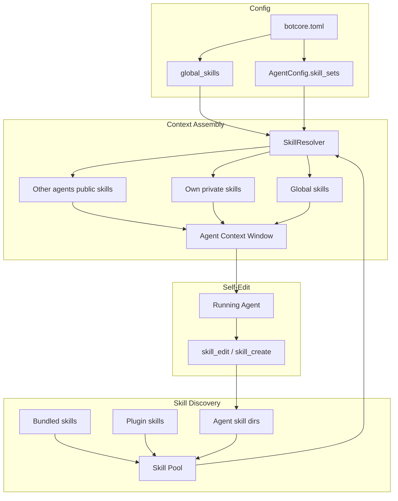

# Agent Skill Scoping

> Foundation spec — enables per-agent skill context, visibility tiers, and self-editing capabilities for multi-agent teams.

## Overview

Agents currently share a single global skill pool. Every skill in `.claude/skills/` is available to every agent equally — there's no way to scope skills to specific agents, share selected skills across the team, or let agents refine their own knowledge. This spec adds three capabilities:

1. **Skill scoping** — each agent declares which skill sets it uses, controlling what knowledge enters its context window
2. **Skill visibility** — skills declare `visibility: public | private` so agents can advertise capabilities without exposing operational details
3. **Skill self-editing** — agents can create and edit skills they own, enabling learning and self-improvement over time

Without this, every agent pays the token cost of 54+ skills, agents can't discover what teammates are good at, and no agent can improve its own knowledge base.

## Status

| Field | Value |
|---|---|
| Status | Active |
| Author | AI-assisted |
| Date | 2026-02-27 |
| Priority | Foundation (blocks multi-agent routing and agent self-improvement) |
| Depends On | Agent capability declarations (complete), per-agent permissions (complete) |

## Problem

### Token budget waste

An agent with 54 bundled skills in context burns thousands of tokens on irrelevant instructions. A security auditor doesn't need `build-stories` or `implement-i18n`. Scoping skills to 5–8 per agent makes them faster, cheaper, and more focused.

### No capability discovery

When a lead agent needs to delegate a task, it has no way to know what other agents are good at. It can read agent names and system prompts, but not their actual knowledge — their skills are invisible to teammates .

### Skill–tool incoherence

An agent with the `audit-security` skill but no shell access will be instructed to run commands it can't execute. This wastes tokens, confuses the model, and produces hallucinated outputs. Skills and tools MUST be coherent.

### No learning loop

Agents can't refine their own knowledge. If an agent discovers a better pattern for its task, it has no way to persist that learning. The next session starts from the same static skill files.

## Architecture



### Context assembly formula

```
Agent context = global_skills + own_private_skills + other_agents_public_skills
```

| Tier | Source | Who sees it | Push/Pull | Purpose |
|------|--------|-------------|-----------|---------|
| Global | `AgentsPluginConfig.global_skills` | All agents | Push (top-down) | Business context, team norms, coding standards |
| Private | Agent's `skill_sets` + agent-owned skills | Only this agent | N/A (self) | Operational knowledge, tightly coupled to its tools |
| Public | Other agents' skills with `visibility: public` | All agents in pool | Pull (bottom-up) | Capability advertisement, delegation interface |

## Contracts

### Frontmatter Extension

One new field added to `SkillManifest`:

```python
class SkillManifest(BaseModel):
    # ... existing fields unchanged ...

    visibility: Literal["public", "private"] = "private"
    """Skill visibility for multi-agent context assembly.
    private (default) = only visible to the owning agent.
    public = visible to all agents in the pool (capability advertisement).
    """

    locked: bool = False
    """Whether this skill is protected from agent self-editing.
    False (default) = editable by the owning agent (if allow_skill_edit is True).
    True = immutable — agents cannot modify or delete this skill.
    Operators and skill_seed can still update locked skills.
    """
```

**Default is `private`** — skills are scoped to their owner unless explicitly shared. This matches the constrained agency principle.

**`locked` defaults to `False`** — skills are editable unless explicitly protected. The lock is a defense-in-depth layer: even with `allow_skill_edit` enabled, locked skills are immutable to the agent. This lets operators hand-craft core operational skills and protect them while still allowing the agent to create and refine its own learned patterns.

### AgentConfig Changes

Three new fields:

```python
class AgentConfig(BaseModel):
    # ... existing fields unchanged ...

    skill_sets: list[str] = Field(default_factory=list)
    """Skill names (matching skill directory names) scoped to this agent.
    [] = no skill scoping (agent gets global skills + public skills only).
    ["audit-security", "code-reviewer"] = agent gets these skills as private
    context, plus global skills and other agents' public skills.
    """

    skills_dir: str = ""
    """Directory for agent-owned skills (relative to workspace root).
    Default: ".claude/skills/agents/{agent_name}" (auto-created on first edit).
    Skills in this directory are owned by the agent and editable by it.
    """

```

### AgentsPluginConfig Changes

One new field:

```python
class AgentsPluginConfig(BaseModel):
    # ... existing fields unchanged ...

    global_skills: list[str] = Field(default_factory=list)
    """Skills injected into every agent's context regardless of skill_sets.
    ["botcore-principles", "code-standards-learn"] = all agents get these.
    [] = no global skills (agents only see their own skill_sets + public skills).
    """
```

### Field Interactions

| `global_skills` | `skill_sets` | Agent-owned dir | Result |
|---|---|---|---|
| `["standards"]` | `["security"]` | has `_intro.md` | `standards` + `security` + own skills + other public skills |
| `["standards"]` | `[]` | empty | `standards` + other public skills only |
| `[]` | `["security", "review"]` | empty | `security` + `review` + other public skills |
| `[]` | `[]` | empty | Other public skills only (minimal context) |

### Config Example

```toml
[tool.botcore.plugins.agents]
default_model = "gpt-4.1"
global_skills = ["botcore-principles", "code-standards-learn", "team-culture"]

[tool.botcore.plugins.agents.agents.security-auditor]
role = "security"
model = "claude-sonnet-4-20250514"
system_prompt = "You are a security auditor..."
skill_sets = ["audit-security", "code-reviewer", "authentication-learn"]
connectors = ["github"]
permissions.allow_shell = true
permissions.shell_allowlist = ["ruff *", "grep *", "semgrep *"]

[tool.botcore.plugins.agents.agents.test-writer]
role = "testing"
system_prompt = "You are a test engineer..."
skill_sets = ["test-writer", "component-tester", "problem-solver"]
connectors = []
permissions.allow_shell = true
permissions.shell_allowlist = ["pytest *", "vitest *"]

[tool.botcore.plugins.agents.agents.researcher]
role = "research"
system_prompt = "You gather information and summarize findings..."
skill_sets = ["research"]
connectors = ["github"]
permissions.allow_shell = false
```

### Agent-Owned Skills Directory Structure

```
.claude/skills/agents/                    # Agent-owned skills root
├── security-auditor/                     # Agent name
│   ├── _intro.md                         # Public — capability advertisement
│   ├── audit-checklist/                  # Private — operational knowledge
│   │   └── SKILL.md
│   └── triage-patterns/                  # Private — learned patterns
│       └── SKILL.md
├── test-writer/
│   ├── _intro.md                         # Public — "I write and fix tests..."
│   └── coverage-strategies/
│       └── SKILL.md
└── researcher/
    └── _intro.md                         # Public — "I research topics..."
```

**`_intro.md`** is a conventional name for the public capability advertisement skill. It MUST have `visibility: public` in its frontmatter. Agents MAY have additional public skills, but most operational skills SHOULD be private.

Example `_intro.md`:

```markdown
---
name: security-auditor-intro
description: What the security auditor can do and how to request its help
visibility: public
source: security-auditor
---

# Security Auditor

I review code and infrastructure for security vulnerabilities.

## What I Can Do

- OWASP Top 10 vulnerability scanning
- Dependency audit and CVE checking
- Threat modeling for new features
- Security-focused code review

## How to Ask Me

Assign a task with a file path, PR reference, or feature description.
I'll return a structured report with findings classified as
BLOCKER / IMPROVEMENT / INFO.

## What I Need

- Read access to source code
- Shell access for running `ruff`, `grep`, `semgrep`
- GitHub connector for PR comments
```

### Skill Resolution API

New module: `packages/botcore-agents/src/botcore_agents/skills.py`

```python
from dataclasses import dataclass


@dataclass
class ResolvedSkillSet:
    """The assembled skill set for a single agent."""

    global_skills: list[SkillEntry]
    private_skills: list[SkillEntry]
    public_skills: list[SkillEntry]  # from other agents
    own_public_skills: list[SkillEntry]  # this agent's public skills

    @property
    def all_skills(self) -> list[SkillEntry]:
        """All skills in context assembly order."""
        return self.global_skills + self.private_skills + self.public_skills


@dataclass
class SkillEntry:
    """A resolved skill ready for context injection."""

    name: str
    source: str
    visibility: str  # "public" | "private"
    content: str  # Full SKILL.md body (for context injection)
    agent_owner: str  # Agent that owns this skill ("" for global/bundled)


async def resolve_agent_skills(
    agent_name: str,
    agent_config: AgentConfig,
    plugin_config: AgentsPluginConfig,
    all_agent_configs: dict[str, AgentConfig],
) -> ResolvedSkillSet:
    """Assemble the complete skill set for an agent.

    Resolution:
    1. Load global skills from plugin_config.global_skills
    2. Load private skills from agent_config.skill_sets + agent-owned dir
    3. Load public skills from all OTHER agents' owned dirs
    4. Deduplicate: private wins over public, global wins over both
    """
    ...
```

### Skill Editing Commands

Two new commands in `botcore-agents`:

```python
async def agent_skill_edit(
    agent_name: str,
    skill_name: str,
    content: str,
) -> CommandResult[dict]:
    """Edit or create a skill owned by an agent.

    Rules:
    - Agent MUST only edit skills in its own skills_dir
    - Skill MUST NOT be locked (frontmatter `locked: true`)
    - skill_name MUST be kebab-case, max 64 chars
    - Content MUST be valid SKILL.md format (frontmatter + body)
    - Source field is forced to agent_name (agents can't claim other sources)
    - Locked field MUST NOT be set or changed by agents (operator-only)
    - Visibility field MUST be preserved if editing, defaulted to private if creating
    - Runs skill_lint validation before writing
    """
    ...


async def agent_skill_delete(
    agent_name: str,
    skill_name: str,
) -> CommandResult[dict]:
    """Delete a skill owned by an agent.

    Rules:
    - Agent MUST only delete skills in its own skills_dir
    - Skill MUST NOT be locked (frontmatter `locked: true`)
    - MUST NOT delete skills with source != agent_name
    - Returns the deleted skill content for undo capability
    """
    ...
```

### Skill–Tool Coherence Validation

New validation at agent create/start time:

```python
async def validate_skill_coherence(
    agent_name: str,
    resolved_skills: ResolvedSkillSet,
    available_tools: list[str],
    permissions: AgentPermissionsConfig,
) -> list[CoherenceWarning]:
    """Check for skills that reference tools the agent doesn't have.

    Produces warnings (not errors) since some skills are purely
    knowledge-based and don't require tool access.

    Checks:
    - Skills with allowed-tools frontmatter: all listed tools MUST be in available_tools
    - Skills that reference shell commands: agent MUST have allow_shell=True
    - Skills that reference filesystem operations: agent MUST have allow_filesystem=True
    """
    ...


@dataclass
class CoherenceWarning:
    """A skill references a capability the agent lacks."""

    skill_name: str
    missing_capability: str  # tool name or permission
    severity: str  # "warning" | "info"
    message: str
```

Coherence validation MUST produce warnings, not errors. Rationale: some skills are pure knowledge (principles, standards, business context) and don't require specific tools. Blocking on coherence would prevent valid configurations.

### Self-Edit Permission Model

Skill editing is gated by a new permission field:

```python
class AgentPermissionsConfig(LlmPermissionsConfig):
    # ... existing fields unchanged ...

    allow_skill_edit: bool = False
    """Whether this agent can create/edit/delete its own skills.
    False (default) = agent has read-only access to its skills.
    True = agent can modify skills in its own skills_dir.
    Note: locked skills are still immutable even when this is True.
    """
```

**Default is `False`** — self-editing is opt-in. This prevents agents from accidentally corrupting their own skill files during routine operation.

### Skill Locking

Locking uses a single source: the `locked: true` field in skill frontmatter. This keeps the model simple — the lock travels with the skill file and is visible to anyone reading it.

**Locking applies only to agent self-editing.** Operators, `skill_seed --update`, and plugin installs can still modify locked skills. The lock is a guardrail for agents, not a file permission.

Example: an operator writes a detailed `audit-checklist` skill with precise security criteria. They set `locked: true` in its frontmatter. The agent can use this skill, benefit from it, but can't weaken it by "improving" the checklist. Meanwhile, the agent freely creates and edits its own `triage-patterns` skill based on what it learns during audits.

Self-edit boundaries:
- An agent MUST only edit skills in its own `skills_dir`
- An agent MUST NOT edit global skills or other agents' skills
- An agent MUST NOT edit skills that are locked (frontmatter `locked: true`)
- An agent MUST NOT change the `locked` field on any skill (operator-only)
- An agent MUST NOT change the `source` field to anything other than its own name
- An agent MUST NOT change `visibility` from `public` to `private` on an existing public skill without a coherence re-check (other agents may depend on reading it)
- All edits MUST pass `skill_lint` validation before writing
- All edits MUST be logged for audit (skill name, agent name, timestamp, before/after hash)

## Requirements

### Functional

- `SkillManifest` MUST accept a `visibility` field with values `"public"` or `"private"`, defaulting to `"private"`
- `AgentConfig` MUST accept `skill_sets: list[str]` for declaring scoped skills
- `AgentConfig` MUST accept `skills_dir: str` for agent-owned skill storage
- `AgentsPluginConfig` MUST accept `global_skills: list[str]` for team-wide skills
- Agent context assembly MUST follow: `global + own_private + other_public`
- Deduplication MUST follow precedence: private > public > global (if same skill name appears in multiple tiers)
- `agent_skill_edit` MUST enforce ownership — agents can only edit skills in their own `skills_dir`
- `agent_skill_edit` MUST reject edits to locked skills (frontmatter `locked: true`)
- `agent_skill_edit` MUST NOT allow agents to change the `locked` field
- `agent_skill_edit` MUST force `source` to the agent's name
- `agent_skill_edit` MUST run `skill_lint` validation before writing
- `agent_skill_delete` MUST reject deletion of locked skills
- `agent_skill_delete` MUST return deleted content for undo support
- Coherence validation MUST warn (not error) on skill–tool mismatches
- Self-editing MUST be gated by `allow_skill_edit` permission (default `False`)
- Skill resolution MUST warn (not crash) when `skill_sets` references a non-existent skill directory
- All skill edits MUST be audit-logged (agent, skill, timestamp, content hash)

### Non-Functional

- Skill resolution MUST complete in < 50ms for ≤ 20 agents with ≤ 15 skills each
- Agent-owned skill dirs MUST be auto-created only on first edit (no empty dirs)
- Global skill loading MUST be cached per orchestrator lifecycle (not re-read per agent)
- Public skill discovery MUST be O(agents × public_skills), not O(agents × all_skills)
- Frontmatter parsing MUST use existing `parse_frontmatter()` / `render_frontmatter()` — no new parser

## Testing

| Test | Assertion |
|------|-----------|
| Agent with `skill_sets: ["security"]` | Only `security` skill + globals + public skills in context |
| Agent with `skill_sets: []` | Only globals + public skills in context |
| `global_skills: ["standards"]` | Every agent gets `standards` in context |
| Skill with `visibility: public` | Visible to all agents in pool |
| Skill with `visibility: private` (default) | Visible only to owning agent |
| `_intro.md` with `visibility: public` | Appears in other agents' public skill set |
| Same skill in global and private | Private copy wins (precedence) |
| `agent_skill_edit` with valid content | Skill written to agent's dir, source forced |
| `agent_skill_edit` on another agent's skill | Error: ownership violation |
| `agent_skill_edit` without `allow_skill_edit` | Error: permission denied |
| `agent_skill_delete` returns content | Deleted content in response for undo |
| Coherence: skill references unavailable tool | Warning logged, agent still starts |
| Coherence: shell skill without `allow_shell` | Warning: "audit-security references shell but agent lacks allow_shell" |
| Two agents, each with public `_intro.md` | Each sees the other's intro, not their own (no self-reference) |
| Agent edits own `_intro.md` visibility | Public→private blocked if other agents reference pattern |
| Skill lint fails on edit | Edit rejected, original preserved |
| Audit log on edit | Log entry with agent, skill, timestamp, hash |
| Skill with `locked: true` in frontmatter | `agent_skill_edit` returns error: skill is locked |
| `skill_sets` references non-existent skill | Warning logged, agent starts without that skill |
| Agent tries to set `locked: true` via edit | Edit rejected: agents cannot change the `locked` field |
| Agent tries to delete locked skill | `agent_skill_delete` returns error: skill is locked |
| Unlocked skill edited normally | Edit succeeds (lock doesn't affect unlocked skills) |
| Operator updates locked skill via `skill_seed` | Succeeds — lock only applies to agent self-edit |

## Task Breakdown

### Wave 1 — Models and Config (no runtime changes)

1. Add `visibility` and `locked` fields to `SkillManifest` in `frontmatter.py`
2. Add `skill_sets`, `skills_dir` to `AgentConfig`
3. Add `global_skills` to `AgentsPluginConfig`
4. Add `allow_skill_edit` to `AgentPermissionsConfig`
5. Tests for all new config fields and defaults

### Wave 2 — Skill Resolution

6. Implement `skills.py` module with `resolve_agent_skills()`
7. Implement global skill loading with caching
8. Implement private skill loading from `skill_sets` + agent-owned dir
9. Implement public skill discovery across agents
10. Implement deduplication with precedence rules
11. Tests for resolution logic, deduplication, and edge cases

### Wave 3 — Self-Editing Commands

12. Implement `agent_skill_edit` command with ownership enforcement and lock checks
13. Implement `agent_skill_delete` command with undo content and lock checks
14. Implement audit logging for skill mutations
15. Integrate `skill_lint` validation into edit path
16. Tests for edit/delete, permission gates, and audit

### Wave 4 — Coherence and Integration

17. Implement `validate_skill_coherence()` warning system
18. Integrate skill resolution into `start_agent()` flow
19. Wire resolved skills into LLM session context
20. End-to-end test: multi-agent with scoped skills, public discovery, self-edit

## Migration

- Existing `SkillManifest` gains `visibility` with default `"private"` — no existing skills are affected
- Existing agents with no `skill_sets` get globals + public skills only — strictly less context than before (improvement)
- No breaking config changes — all new fields have safe defaults
- Agents that want self-edit capability MUST opt in via `allow_skill_edit: true`
- Agent-owned skill dirs are created on demand — no migration script needed

## Risks

| Risk | Mitigation |
|------|------------|
| Token budget still too large with many public skills | Public skills SHOULD be short (< 50 lines). Coherence validation warns on oversized public skills |
| Agent corrupts its own skills via self-edit | `skill_lint` validation gate + audit log + undo via `agent_skill_delete` return value. Lock critical skills with frontmatter `locked: true` |
| Agent weakens operator-crafted skills | Lock operator-authored skills via frontmatter `locked: true`. Locked skills are immutable to agents |
| Circular dependency: agent A's public skill references agent B, and vice versa | Context assembly is flat (no transitive skill loading). Public skills are informational only |
| `_intro.md` convention not enforced | Convention only — any skill with `visibility: public` is discoverable. `_intro.md` is the recommended pattern |
| Agent edits public skill to inject prompt for other agents | Audit logging + `source` enforcement. Public skill content is visible to operators via `skill_list` |
| Many agents with many public skills overwhelm context | Cap public skills per agent (configurable, default 3). Warn if total public skill tokens exceed threshold |
| Skill resolution performance with large pools | Cache global skills per lifecycle. Public skill discovery is O(agents × public_skills_per_agent), bounded by cap |
| Agent deletes its public skill, breaking other agents' expectations | Warning only — other agents lose the public skill from context but continue operating. No hard dependency |
