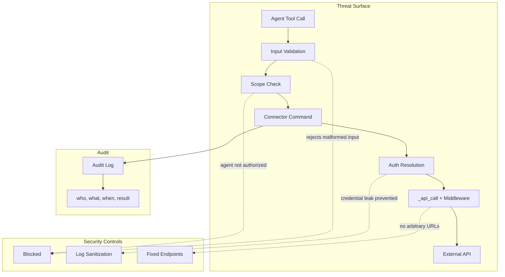
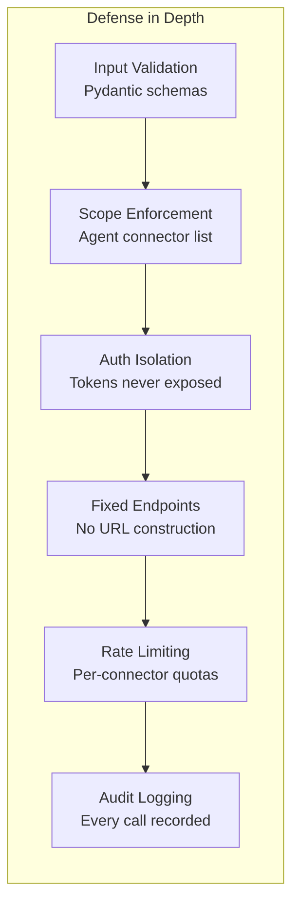

# Security Model & Threat Mitigations Specification

> Part of [Typed Connectors Plan](./00-overview.plan.md)

## Overview

This spec formalizes the security invariants that all connectors MUST uphold. Connectors are the sole external access boundary for agents — no raw HTTP, shell, or filesystem access exists. This spec defines RFC 2119 requirements for each threat category, input validation rules, audit logging schema, and agent scoping enforcement. It cross-references the base ([01](./01-connector-base.spec.md)), auth ([02](./02-auth.spec.md)), and config ([03](./03-config-and-plugin.spec.md)) specs to ensure security properties are enforced end-to-end.

## Status

| Field | Value |
|---|---|
| Status | Complete |
| Author | AI-assisted |
| Date | 2026-02-26 |
| Completed | 2026-02-26 |
| Proposal | [00-overview.plan.md](./00-overview.plan.md) |

## Architecture





## Contracts

### AuditLogEntry

```python
from pydantic import BaseModel
from datetime import datetime

class AuditLogEntry(BaseModel):
    timestamp: datetime
    agent_id: str
    connector: str
    command: str
    args_summary: str  # sanitized, no secrets
    result_status: str  # "success" or error code
    latency_ms: float
    trace_id: str
```

### InputValidationResult

```python
from pydantic import BaseModel

class InputValidationResult(BaseModel):
    valid: bool
    violations: list[str] = []
```

## Requirements

### SSRF Prevention

- Connectors MUST NOT construct URLs from user-supplied input — all API endpoints MUST be predefined per connector
- Connectors MUST NOT accept arbitrary URL parameters — only typed, validated fields (repo name, issue ID, etc.)
- The connector base `_api_call` MUST only send requests to the connector's configured `base_url`
- `base_url` MUST be set at connector initialization, not per-request

### Credential Isolation

- Tokens MUST NOT appear in `CommandResult` data, metadata, or reasoning fields (see [02-auth.spec.md](./02-auth.spec.md))
- Tokens MUST NOT appear in tool argument schemas or tool call responses visible to agents
- Tokens MUST NOT appear in log output at any level — log sanitization MUST redact `Authorization` headers and bearer tokens
- Tokens MUST NOT be stored in botcore.toml, agent config, or any persisted file
- `TokenCacheEntry` MUST exclude the `token` field from serialization and repr

### Agent Scope Enforcement

- Each agent's `connectors` config MUST restrict which connector tools are exposed (see [03-config-and-plugin.spec.md](./03-config-and-plugin.spec.md))
- The LLM Runtime bridge MUST NOT expose tools for connectors not in the agent's declared list
- An agent with `connectors = ["github"]` MUST NOT be able to invoke `email_send` or any non-GitHub command
- Scope enforcement MUST occur at the bridge layer, before command dispatch — not within the connector itself
- If an agent has no `connectors` key, the bridge MUST expose zero connector tools (deny by default)

### Rate Limiting & Abuse Prevention

- Every connector MUST apply rate limiting via the middleware stack (see [01-connector-base.spec.md](./01-connector-base.spec.md))
- Rate limits MUST be per-connector, not global — one connector hitting its limit MUST NOT affect others
- Rate limit configuration MUST be settable per-connector via config
- The system SHOULD log when rate limits are hit for monitoring

### Input Validation

- All connector command inputs MUST be validated via Pydantic models before any API call
- String fields MUST enforce maximum length: 256 chars for identifiers, 64KB for body text
- List fields MUST enforce maximum item count: 100 items default
- Fields with known formats MUST use AFD pattern types (`EmailStr`, `UuidStr`) where applicable
- Repository name fields MUST validate the `owner/repo` format
- Path fields MUST reject path traversal patterns (`../`, `..\\`)

### Audit Logging

- Every connector command invocation MUST produce an audit log entry
- Audit entries MUST include: timestamp, agent ID, connector name, command name, sanitized args summary, result status, latency, and trace ID
- Audit entries MUST NOT contain raw credentials, full response bodies, or PII beyond what the command naturally processes
- Audit log entries SHOULD be structured (JSON) for machine parsing

### Data Exfiltration Prevention

- Connectors MUST be the ONLY mechanism for agents to access external systems
- No raw HTTP, shell exec, or filesystem access MUST be available to agents
- This invariant is enforced architecturally by the tool bridge — agents only see registered commands as tools

## Error Handling

| Error Code | Condition | Recovery |
|---|---|---|
| `SCOPE_VIOLATION` | Agent attempted a connector command outside its declared scope | Configure the agent's `connectors` list to include this connector |
| `INPUT_VALIDATION_FAILED` | Pydantic validation rejected command input | Fix input per validation error details |
| `INPUT_TOO_LARGE` | String or list field exceeded maximum size | Reduce input size within documented limits |
| `PATH_TRAVERSAL_BLOCKED` | Path field contained `../` or `..\\` | Use direct path without traversal sequences |
| `AUDIT_WRITE_FAILED` | Audit log entry could not be written | Non-blocking — command proceeds, but alert on persistent failures |

## Configuration

| Key | Type | Default | Description |
|---|---|---|---|
| `connectors.*.rate_limit_rps` | `float` | `10.0` | Per-connector requests-per-second ceiling |
| `connectors.*.max_input_length` | `int` | `65536` | Maximum bytes for text body fields |
| `connectors.*.max_list_items` | `int` | `100` | Maximum items in list-type fields |
| `agents.<name>.connectors` | `list[str]` | `[]` | Connectors this agent may use (empty = none) |

## Task Breakdown

### Wave 1: Input Validation

- [ ] Add max-length and max-items validators to connector Pydantic models — acceptance: inputs exceeding limits produce `INPUT_TOO_LARGE` error
- [ ] Add path traversal rejection for path-type fields — acceptance: `../etc/passwd` rejected with `PATH_TRAVERSAL_BLOCKED`
- [ ] Validate `owner/repo` format for repository fields — acceptance: `"badrepo"` rejected, `"owner/repo"` accepted

### Wave 2: Scope Enforcement

- [ ] Implement connector prefix filtering in LLM Runtime bridge — acceptance: agent with `connectors=["github"]` sees only `github_*` tools
- [ ] Default to zero connector tools when no `connectors` key is set — acceptance: unconfigured agent has no connector tools
- [ ] Return `SCOPE_VIOLATION` for out-of-scope command attempts — acceptance: bridge returns error before command dispatch

### Wave 3: Audit Logging

- [ ] Define `AuditLogEntry` model — acceptance: serializes to JSON with all required fields
- [ ] Emit audit log on every command invocation — acceptance: success and error paths both produce audit entries
- [ ] Sanitize args summary (strip tokens, truncate large bodies) — acceptance: no credentials in audit output

### Wave 4: Verification

- [ ] Integration test: credential isolation end-to-end — acceptance: successful command result contains no token substrings
- [ ] Integration test: scope enforcement end-to-end — acceptance: cross-scope command rejected before API call
- [ ] Review all log output points for token leakage — acceptance: grep of log output during test suite finds zero token occurrences

## Acceptance Criteria

- [ ] No connector accepts arbitrary URLs — all endpoints are predefined
- [ ] Tokens never appear in `CommandResult`, tool responses, config, or logs
- [ ] Agent scope enforcement blocks out-of-scope commands at the bridge layer
- [ ] Rate limits are per-connector and configurable
- [ ] All string inputs enforce max-length validation
- [ ] All list inputs enforce max-item-count validation
- [ ] Path fields reject traversal patterns
- [ ] Every command invocation produces a structured audit log entry
- [ ] Audit log entries contain no raw credentials
- [ ] Agents without a `connectors` config key have zero connector tools (deny by default)

## Rollback Plan

Security controls are layered — each can be disabled independently if causing issues:

1. **Input validation:** Relax max-length/max-items limits via config; path traversal check can be bypassed by removing the validator
2. **Scope enforcement:** Set `connectors = ["*"]` (if supported) or list all connectors to bypass scoping
3. **Audit logging:** Disable audit log emission via config flag; commands still function
4. **Rate limiting:** Set `rate_limit_rps` to a very high value to effectively disable
5. **Full rollback:** Remove `botcore-connectors` package — all security controls removed along with connector functionality
