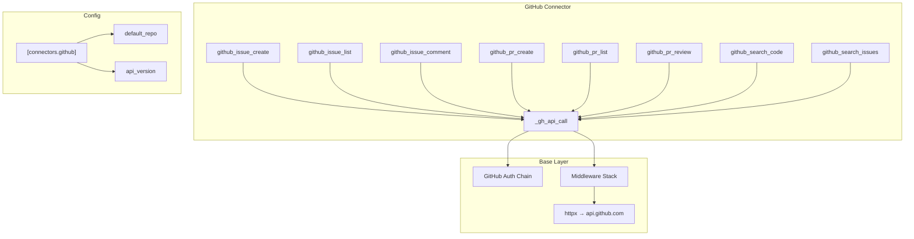
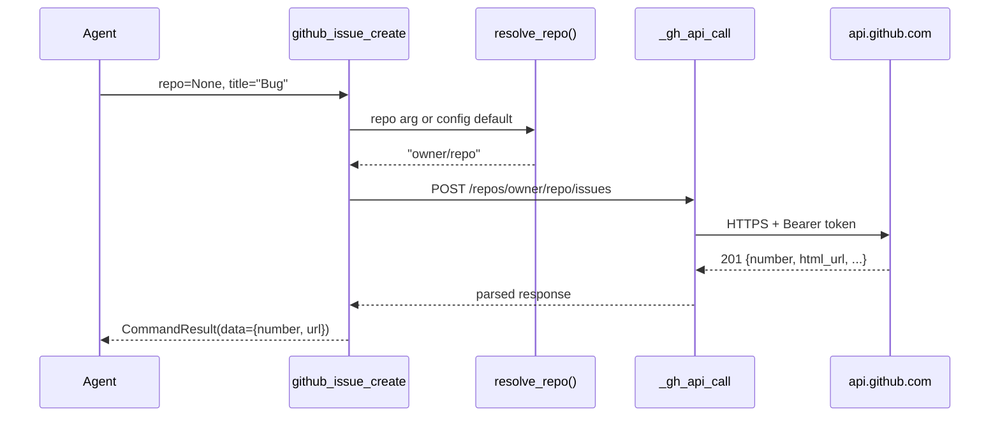

# GitHub Connector Specification

> Part of [Typed Connectors Plan](./00-overview.plan.md)

## Overview

This spec defines the GitHub connector — the first Tier 1 concrete connector and the validation case for the connector base pattern ([01](./01-connector-base.plan.md)). It covers 8 commands under the `github_` prefix, their parameter types, output data shapes, GitHub-specific rate limit handling, pagination mapping, and default repository resolution from config. All commands return `CommandResult` values and authenticate via the GitHub auth chain ([02](./02-auth.plan.md)).

## Status

| Field | Value |
|---|---|
| Status | Complete |
| Author | AI-assisted |
| Date | 2026-02-26 |
| Completed | 2026-02-26 |
| Proposal | [00-overview.plan.md](./00-overview.plan.md) |

## Architecture





## Contracts

### Command Signatures

```python
from botcore.commands import CommandResult
from afd.validation import PaginationParams

async def github_issue_create(
    repo: str | None = None,
    title: str = ...,
    body: str = "",
    labels: list[str] | None = None,
    assignees: list[str] | None = None,
) -> CommandResult[dict]: ...

async def github_issue_list(
    repo: str | None = None,
    state: str = "open",
    labels: list[str] | None = None,
    pagination: PaginationParams = PaginationParams(),
) -> CommandResult[list[dict]]: ...

async def github_issue_comment(
    repo: str | None = None,
    issue_number: int = ...,
    body: str = ...,
) -> CommandResult[dict]: ...

async def github_pr_create(
    repo: str | None = None,
    title: str = ...,
    body: str = "",
    head: str = ...,
    base: str = "main",
    draft: bool = False,
) -> CommandResult[dict]: ...

async def github_pr_list(
    repo: str | None = None,
    state: str = "open",
    pagination: PaginationParams = PaginationParams(),
) -> CommandResult[list[dict]]: ...

async def github_pr_review(
    repo: str | None = None,
    pr_number: int = ...,
    event: str = ...,
    body: str = "",
) -> CommandResult[dict]: ...

async def github_search_code(
    query: str = ...,
    repo: str | None = None,
    pagination: PaginationParams = PaginationParams(),
) -> CommandResult[list[dict]]: ...

async def github_search_issues(
    query: str = ...,
    repo: str | None = None,
    state: str | None = None,
    pagination: PaginationParams = PaginationParams(),
) -> CommandResult[list[dict]]: ...
```

### Output Data Shapes

```python
from typing import TypedDict

class IssueResult(TypedDict):
    number: int
    url: str
    title: str
    state: str

class PRResult(TypedDict):
    number: int
    url: str
    title: str
    state: str
    head: str
    base: str
    draft: bool

class CommentResult(TypedDict):
    id: int
    url: str

class ReviewResult(TypedDict):
    id: int
    state: str  # "APPROVED", "CHANGES_REQUESTED", "COMMENTED"

class CodeSearchResult(TypedDict):
    path: str
    repo: str
    url: str
    score: float

class IssueSearchResult(TypedDict):
    number: int
    repo: str
    title: str
    state: str
    url: str
```

## Requirements

### Functional

- All 8 commands MUST return `CommandResult` with typed data shapes as defined above
- All commands accepting `repo` MUST resolve it via: explicit argument → `connectors.github.default_repo` config → `CONFIG_MISSING_REQUIRED` error
- `repo` format MUST be validated as `owner/repo` — reject other formats with `INVALID_REPO` error and suggestion
- `github_pr_review.event` MUST be one of: `"APPROVE"`, `"REQUEST_CHANGES"`, `"COMMENT"` — reject others with `INVALID_INPUT`
- List commands MUST support pagination via `PaginationParams`
- `PaginationParams.page` MUST map to GitHub's `page` query parameter
- `PaginationParams.page_size` MUST map to GitHub's `per_page` query parameter (max 100)
- Search commands MUST use the GitHub Search API (`/search/code`, `/search/issues`)
- All commands MUST send the `X-GitHub-Api-Version` header from config
- `github_issue_create` and `github_pr_create` MUST include created resource URL in the `CommandResult.reasoning` field

### GitHub-Specific Rate Limiting

- The connector MUST read `X-RateLimit-Remaining` and `X-RateLimit-Reset` response headers
- When `X-RateLimit-Remaining` reaches 0, the connector MUST pause requests until the `X-RateLimit-Reset` timestamp
- On HTTP 429, the connector MUST use `X-RateLimit-Reset` for backoff timing instead of the generic exponential backoff
- The search API has a separate rate limit (30 requests/min) — search commands SHOULD respect this independently
- When rate-limited, the error MUST include the reset time in the suggestion (e.g., "Rate limit resets at 14:30 UTC")

### GitHub Auth

- The connector MUST authenticate via the GitHub auth chain defined in [02-auth.plan.md](./02-auth.plan.md)
- The `Authorization: Bearer <token>` header MUST be set by `_gh_api_call`, not by individual commands
- On HTTP 401, `_gh_api_call` MUST invalidate the cached token and retry once before returning `AUTH_FAILED`

## Error Handling

| Error Code | Condition | Recovery |
|---|---|---|
| `INVALID_REPO` | `repo` argument not in `owner/repo` format | Use format: `owner/repo` (e.g., `lushly-dev/botcore`) |
| `GITHUB_AUTH_MISSING` | No GitHub token resolved | Set `GH_TOKEN` env variable or run `gh auth login` |
| `GITHUB_NOT_FOUND` | Repository or resource does not exist (404) | Verify the repository name and your access permissions |
| `GITHUB_RATE_LIMITED` | API rate limit exceeded | Wait until rate limit resets at {reset_time} |
| `GITHUB_SEARCH_RATE_LIMITED` | Search API rate limit exceeded (30/min) | Wait 60 seconds or reduce search frequency |
| `GITHUB_VALIDATION_ERROR` | GitHub API rejected input (422) | Review field values against GitHub API constraints |
| `INVALID_INPUT` | Command argument failed local validation | Fix the argument per the error message |
| `CONFIG_MISSING_REQUIRED` | No repo provided and no `default_repo` configured | Pass `repo` argument or set `connectors.github.default_repo` in botcore.toml |

## Configuration

| Key | Type | Default | Description |
|---|---|---|---|
| `connectors.github.default_repo` | `str \| None` | `None` | Default `owner/repo` used when commands omit `repo` |
| `connectors.github.api_version` | `str` | `"2022-11-28"` | Value for `X-GitHub-Api-Version` header |

Base configuration (timeout, retries, rate limiting) inherits from [01-connector-base.plan.md](./01-connector-base.plan.md).

## Task Breakdown

### Wave 1: Scaffold & Auth

- [ ] Create `botcore_connectors/github.py` with `_gh_api_call` using the connector base — acceptance: makes authenticated GET to `api.github.com` and returns `CommandResult`
- [ ] Implement repo resolution (arg → config default → error) — acceptance: `None` repo with config default resolves; `None` without config returns `CONFIG_MISSING_REQUIRED`
- [ ] Implement repo format validation — acceptance: `"badrepo"` returns `INVALID_REPO`; `"owner/repo"` passes

### Wave 2: Issue Commands

- [ ] Implement `github_issue_create` — acceptance: returns `IssueResult` with number and URL from mocked 201 response
- [ ] Implement `github_issue_list` with pagination — acceptance: `PaginationParams(page=2, page_size=10)` maps to `?page=2&per_page=10`
- [ ] Implement `github_issue_comment` — acceptance: returns `CommentResult` with id and URL

### Wave 3: PR Commands

- [ ] Implement `github_pr_create` — acceptance: returns `PRResult` with number, URL, and draft status
- [ ] Implement `github_pr_list` with pagination — acceptance: filters by state, paginates correctly
- [ ] Implement `github_pr_review` with event validation — acceptance: rejects invalid event values; returns `ReviewResult`

### Wave 4: Search Commands

- [ ] Implement `github_search_code` — acceptance: maps query to `/search/code` endpoint; returns `CodeSearchResult` list
- [ ] Implement `github_search_issues` — acceptance: maps query+state to `/search/issues`; returns `IssueSearchResult` list
- [ ] Implement search-specific rate limit handling (30/min) — acceptance: tracks search rate separately from REST API rate

### Wave 5: Rate Limiting & Integration

- [ ] Implement `X-RateLimit-Remaining`/`X-RateLimit-Reset` header reading — acceptance: pauses requests when remaining = 0
- [ ] Use reset timestamp for 429 backoff instead of generic exponential — acceptance: retry delay matches `X-RateLimit-Reset` minus current time
- [ ] Integration tests with mocked HTTP — acceptance: all 8 commands tested with success, 401 retry, 404, 422, and 429 scenarios

## Acceptance Criteria

- [ ] All 8 commands return `CommandResult` with the documented data shape
- [ ] `repo` resolves via: explicit arg → config default → error
- [ ] Invalid repo format (`"badrepo"`) returns `INVALID_REPO` with suggestion
- [ ] `github_pr_review` rejects invalid event values
- [ ] Pagination params map correctly to GitHub's `page`/`per_page` query parameters
- [ ] `X-RateLimit-Remaining: 0` causes request pausing until reset timestamp
- [ ] HTTP 429 uses `X-RateLimit-Reset` for retry timing
- [ ] HTTP 401 triggers token invalidation and one retry before `AUTH_FAILED`
- [ ] Search commands respect the 30 requests/minute search rate limit
- [ ] All commands include the `X-GitHub-Api-Version` header
- [ ] Created resources include URL in `CommandResult.reasoning`

## Rollback Plan

1. Remove `github.py` from `botcore-connectors`
2. Remove `"github"` from the connector registry in `ConnectorsPlugin.register()`
3. Agents lose GitHub commands — they receive no `github_*` tools
4. No other connectors are affected
