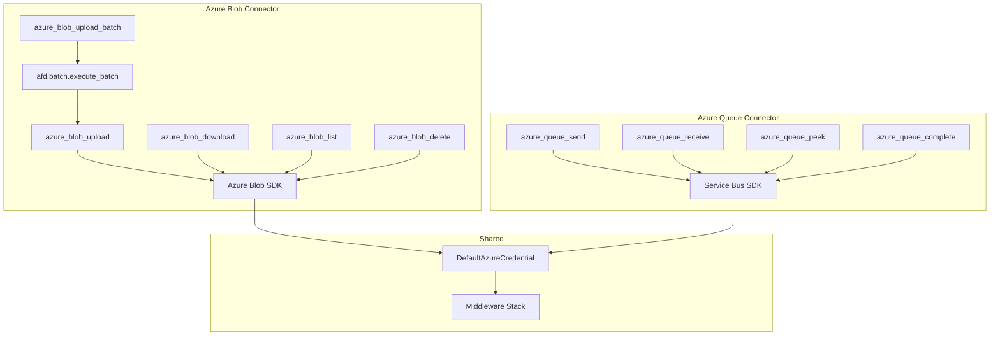

# Azure Blob & Service Bus Connector Specification

> Part of [Typed Connectors Plan](./00-overview.plan.md)
>
> **Deferred** — this spec will be refined when Phase 2 approaches. Structure and contracts are defined; implementation details will be elaborated after Phase 1 validates the connector base pattern.

## Overview

This spec defines the Azure Tier 1 connectors: Azure Blob Storage (`azure_blob_*`) and Azure Service Bus (`azure_queue_*`). Blob commands provide upload, download, list, and delete operations with batch upload support via AFD `execute_batch()`. Queue commands provide send, receive, peek, and complete operations with lock-based message processing. Both authenticate via `DefaultAzureCredential` ([02](./02-auth.plan.md)) and use the connector base ([01](./01-connector-base.plan.md)).

## Status

| Field | Value |
|---|---|
| Status | Draft (Deferred) |
| Author | AI-assisted |
| Date | 2026-02-26 |
| Proposal | [00-overview.plan.md](./00-overview.plan.md) |

## Architecture



## Contracts

### Blob Command Signatures

```python
from botcore.commands import CommandResult
from afd.batch import BatchResult

async def azure_blob_upload(
    path: str = ...,
    content: bytes | str = ...,
    container: str | None = None,
    content_type: str | None = None,
) -> CommandResult[dict]: ...

async def azure_blob_download(
    path: str = ...,
    container: str | None = None,
) -> CommandResult[dict]: ...

async def azure_blob_list(
    prefix: str = "",
    container: str | None = None,
    max_results: int = 100,
) -> CommandResult[list[dict]]: ...

async def azure_blob_delete(
    path: str = ...,
    container: str | None = None,
) -> CommandResult[dict]: ...

async def azure_blob_upload_batch(
    files: list[dict] = ...,
    container: str | None = None,
    on_failure: str = "continue",
) -> CommandResult[BatchResult]: ...
```

### Queue Command Signatures

```python
from botcore.commands import CommandResult

async def azure_queue_send(
    message: str | dict = ...,
    queue: str | None = None,
) -> CommandResult[dict]: ...

async def azure_queue_receive(
    queue: str | None = None,
    max_messages: int = 1,
    lock_seconds: int = 30,
) -> CommandResult[list[dict]]: ...

async def azure_queue_peek(
    queue: str | None = None,
    max_messages: int = 1,
) -> CommandResult[list[dict]]: ...

async def azure_queue_complete(
    lock_token: str = ...,
    queue: str | None = None,
) -> CommandResult[dict]: ...
```

### Output Data Shapes

```python
from typing import TypedDict

class BlobUploadResult(TypedDict):
    path: str
    url: str
    size_bytes: int

class BlobDownloadResult(TypedDict):
    path: str
    content_type: str
    size_bytes: int
    content: str  # base64 for binary, utf-8 for text

class BlobListItem(TypedDict):
    path: str
    size_bytes: int
    last_modified: str

class QueueSendResult(TypedDict):
    message_id: str
    sequence_number: int

class QueueMessage(TypedDict):
    message_id: str
    lock_token: str
    body: str | dict
    enqueued_at: str
```

## Requirements

### Functional — Blob

- All blob commands MUST resolve `container` via: explicit argument → `connectors.azure_blob.container` config → `CONFIG_MISSING_REQUIRED` error
- `azure_blob_upload` MUST return the blob URL and size after upload
- `azure_blob_download` MUST return content as base64 for binary types, UTF-8 for text types
- `azure_blob_list` MUST support prefix filtering and return up to `max_results` items
- `azure_blob_delete` MUST return confirmation of deletion; 404 on missing blob MUST return `NOT_FOUND`
- `azure_blob_upload_batch` MUST use AFD `execute_batch()` with configurable `on_failure` ("continue" or "stop")
- `azure_blob_upload_batch` MUST return per-file success/failure results via `BatchResult`
- `path` fields MUST reject path traversal patterns (`../`) per [04-security-model.plan.md](./04-security-model.plan.md)

### Functional — Queue

- All queue commands MUST resolve `queue` via: explicit argument → `connectors.azure_queue.queue_name` config → `CONFIG_MISSING_REQUIRED` error
- `azure_queue_receive` MUST return messages with lock tokens for later completion
- `azure_queue_receive` MUST respect `lock_seconds` for message visibility timeout
- `azure_queue_complete` MUST accept a `lock_token` to acknowledge message processing
- `azure_queue_peek` MUST NOT consume messages — peeked messages remain in the queue
- `azure_queue_send` MUST accept both string and dict message bodies (dict serialized as JSON)

### Non-Functional

- Blob uploads MUST support content up to 100MB per file
- Batch uploads SHOULD process files concurrently (up to 10 concurrent uploads)
- Queue operations MUST complete within the configured timeout from [01-connector-base.plan.md](./01-connector-base.plan.md)

## Error Handling

| Error Code | Condition | Recovery |
|---|---|---|
| `AZURE_AUTH_CHAIN_EXHAUSTED` | All `DefaultAzureCredential` strategies failed | Set Azure env vars, enable managed identity, or run `az login` |
| `AZURE_BLOB_NOT_FOUND` | Blob path does not exist | Verify blob path and container |
| `AZURE_BLOB_ALREADY_EXISTS` | Blob exists and overwrite not requested | Use overwrite flag or delete existing blob |
| `AZURE_BLOB_TOO_LARGE` | File exceeds 100MB limit | Split into smaller files |
| `AZURE_QUEUE_NOT_FOUND` | Queue does not exist | Verify queue name and namespace |
| `AZURE_QUEUE_LOCK_EXPIRED` | Lock token expired before complete() | Receive the message again with longer lock duration |
| `AZURE_QUEUE_EMPTY` | No messages available to receive | Queue is empty — retry later or check queue name |
| `CONFIG_MISSING_REQUIRED` | Container or queue not configured | Set in botcore.toml or pass as argument |

## Configuration

| Key | Type | Default | Description |
|---|---|---|---|
| `connectors.azure_blob.account_name` | `str \| None` | `None` | Azure Storage account name |
| `connectors.azure_blob.container` | `str \| None` | `None` | Default blob container |
| `connectors.azure_queue.namespace` | `str \| None` | `None` | Service Bus fully-qualified namespace |
| `connectors.azure_queue.queue_name` | `str \| None` | `None` | Default queue name |

## Task Breakdown

### Wave 1: Azure Auth Integration

- [ ] Wire `DefaultAzureCredential` into auth resolver — acceptance: resolves token for blob storage resource
- [ ] Test auth chain ordering (env → managed identity → CLI) — acceptance: each fallback level works in isolation

### Wave 2: Blob Commands

- [ ] Implement `azure_blob_upload` — acceptance: uploads blob, returns URL and size
- [ ] Implement `azure_blob_download` — acceptance: returns base64 for binary, UTF-8 for text
- [ ] Implement `azure_blob_list` with prefix filter — acceptance: returns items matching prefix
- [ ] Implement `azure_blob_delete` — acceptance: returns confirmation; 404 → `AZURE_BLOB_NOT_FOUND`
- [ ] Implement `azure_blob_upload_batch` via `execute_batch()` — acceptance: per-file results with "continue" and "stop" modes

### Wave 3: Queue Commands

- [ ] Implement `azure_queue_send` — acceptance: sends message, returns message ID
- [ ] Implement `azure_queue_receive` with lock — acceptance: returns messages with lock tokens
- [ ] Implement `azure_queue_peek` — acceptance: returns messages without consuming
- [ ] Implement `azure_queue_complete` — acceptance: completes by lock token; expired lock → `AZURE_QUEUE_LOCK_EXPIRED`

### Wave 4: Testing

- [ ] Unit tests for all blob commands with mocked Azure SDK — acceptance: success, auth failure, 404, and size limit scenarios
- [ ] Unit tests for all queue commands with mocked Service Bus SDK — acceptance: send, receive, peek, complete, and lock expiry scenarios
- [ ] Integration test: batch upload with partial failures — acceptance: `on_failure="continue"` reports per-file results

## Acceptance Criteria

- [ ] All blob commands resolve container from arg or config
- [ ] Blob upload returns URL and size
- [ ] Batch upload uses `execute_batch()` with per-file results
- [ ] Queue receive returns lock tokens; complete uses them
- [ ] Queue peek does not consume messages
- [ ] Path traversal patterns rejected in blob paths
- [ ] Auth uses `DefaultAzureCredential` chain
- [ ] All unit tests pass with mocked SDKs

## Rollback Plan

1. Remove `azure_blob.py` and `azure_queue.py` from `botcore-connectors`
2. Remove `"azure_blob"` and `"azure_queue"` from the connector registry
3. Remove `azure` optional-dependency group consumers
4. Other connectors (GitHub, Graph) are unaffected
