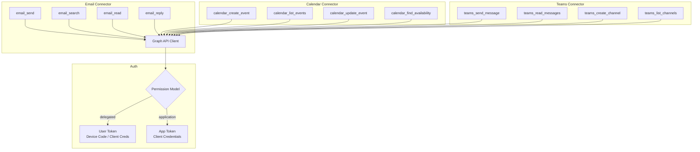
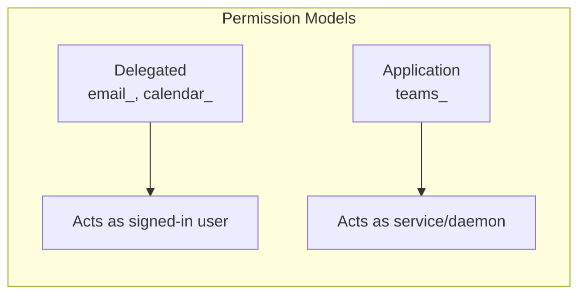

# Microsoft Graph Connector Specification

> Part of [Typed Connectors Plan](./00-overview.plan.md)
>
> **Deferred** — this spec will be refined when Phase 3 approaches. Structure and contracts are defined; permission models and command details will be elaborated after Phase 2 validates the Azure auth patterns.

## Overview

This spec defines the Microsoft Graph Tier 2 connectors: Outlook email (`email_*`), Calendar (`calendar_*`), and Teams (`teams_*`). Each command maps to a specific Microsoft Graph API endpoint with declared permission scopes. The spec distinguishes between delegated permissions (user-context, for email and calendar) and application permissions (daemon-context, for Teams). All commands authenticate via the Graph auth chain ([02](./02-auth.spec.md)) and use the connector base ([01](./01-connector-base.spec.md)).

## Status

| Field | Value |
|---|---|
| Status | Draft (Deferred) |
| Author | AI-assisted |
| Date | 2026-02-26 |
| Proposal | [00-overview.plan.md](./00-overview.plan.md) |

## Architecture





## Contracts

### Email Command Signatures

```python
from botcore.commands import CommandResult
from afd.validation import EmailStr, PaginationParams

async def email_send(
    to: list[EmailStr] = ...,
    subject: str = ...,
    body: str = ...,
    cc: list[EmailStr] | None = None,
    importance: str = "normal",
) -> CommandResult[dict]: ...

async def email_search(
    query: str = ...,
    folder: str = "inbox",
    pagination: PaginationParams = PaginationParams(),
) -> CommandResult[list[dict]]: ...

async def email_read(
    message_id: str = ...,
) -> CommandResult[dict]: ...

async def email_reply(
    message_id: str = ...,
    body: str = ...,
    reply_all: bool = False,
) -> CommandResult[dict]: ...
```

### Calendar Command Signatures

```python
from botcore.commands import CommandResult
from datetime import datetime

async def calendar_create_event(
    subject: str = ...,
    start: datetime = ...,
    end: datetime = ...,
    attendees: list[str] | None = None,
    body: str = "",
    is_online: bool = False,
) -> CommandResult[dict]: ...

async def calendar_list_events(
    start: datetime = ...,
    end: datetime = ...,
    calendar_id: str | None = None,
) -> CommandResult[list[dict]]: ...

async def calendar_update_event(
    event_id: str = ...,
    subject: str | None = None,
    start: datetime | None = None,
    end: datetime | None = None,
    body: str | None = None,
) -> CommandResult[dict]: ...

async def calendar_find_availability(
    attendees: list[str] = ...,
    start: datetime = ...,
    end: datetime = ...,
    duration_minutes: int = 30,
) -> CommandResult[list[dict]]: ...
```

### Teams Command Signatures

```python
from botcore.commands import CommandResult
from afd.validation import PaginationParams

async def teams_send_message(
    team_id: str = ...,
    channel_id: str = ...,
    content: str = ...,
    content_type: str = "text",
) -> CommandResult[dict]: ...

async def teams_read_messages(
    team_id: str = ...,
    channel_id: str = ...,
    pagination: PaginationParams = PaginationParams(),
) -> CommandResult[list[dict]]: ...

async def teams_create_channel(
    team_id: str = ...,
    display_name: str = ...,
    description: str = "",
) -> CommandResult[dict]: ...

async def teams_list_channels(
    team_id: str = ...,
) -> CommandResult[list[dict]]: ...
```

### Permission Scope Mapping

```python
from typing import TypedDict

class ScopeMapping(TypedDict):
    command: str
    permission_type: str  # "delegated" or "application"
    scopes: list[str]

GRAPH_SCOPES: list[ScopeMapping] = [
    # Email (delegated)
    {"command": "email_send", "permission_type": "delegated", "scopes": ["Mail.Send"]},
    {"command": "email_search", "permission_type": "delegated", "scopes": ["Mail.Read"]},
    {"command": "email_read", "permission_type": "delegated", "scopes": ["Mail.Read"]},
    {"command": "email_reply", "permission_type": "delegated", "scopes": ["Mail.Send"]},
    # Calendar (delegated)
    {"command": "calendar_create_event", "permission_type": "delegated", "scopes": ["Calendars.ReadWrite"]},
    {"command": "calendar_list_events", "permission_type": "delegated", "scopes": ["Calendars.Read"]},
    {"command": "calendar_update_event", "permission_type": "delegated", "scopes": ["Calendars.ReadWrite"]},
    {"command": "calendar_find_availability", "permission_type": "delegated", "scopes": ["Calendars.Read"]},
    # Teams (application)
    {"command": "teams_send_message", "permission_type": "application", "scopes": ["ChannelMessage.Send"]},
    {"command": "teams_read_messages", "permission_type": "application", "scopes": ["ChannelMessage.Read.All"]},
    {"command": "teams_create_channel", "permission_type": "application", "scopes": ["Channel.Create"]},
    {"command": "teams_list_channels", "permission_type": "application", "scopes": ["Channel.ReadBasic.All"]},
]
```

## Requirements

### Functional

- All Graph commands MUST authenticate via the Graph auth chain in [02-auth.spec.md](./02-auth.spec.md)
- Each command MUST declare its required permission scopes per the scope mapping above
- Before making a Graph API call, the connector MUST verify the token contains the required scopes
- If the token lacks required scopes, the connector MUST return `ENTRA_SCOPE_INSUFFICIENT` with the missing scope names
- Email and Calendar commands MUST use delegated permissions (user context)
- Teams commands MUST use application permissions (service context)
- `email_send` MUST use the configured `from_address` from `connectors.email.from_address` ([03-config-and-plugin.spec.md](./03-config-and-plugin.spec.md))
- `email_send` and `email_reply` MUST validate recipient addresses using AFD `EmailStr`
- `calendar_find_availability` MUST use the Graph `/me/findMeetingTimes` or `/users/{id}/calendar/getSchedule` endpoint
- `teams_send_message` MUST support both plain text and HTML content types

### Permission Models

- **Delegated** (email, calendar): Token represents a signed-in user; acquired via device code flow or cached refresh token
- **Application** (teams): Token represents the app itself; acquired via client credentials flow
- The connector MUST support both models simultaneously — different commands use different token types
- The auth resolver MUST distinguish between delegated and application token requests

### Non-Functional

- Graph API calls MUST use the v1.0 endpoint (`https://graph.microsoft.com/v1.0/`) unless beta features are required
- The connector SHOULD use the `msgraph-sdk` Python package for request construction
- Pagination for Graph list endpoints MUST use `@odata.nextLink` continuation tokens

## Error Handling

| Error Code | Condition | Recovery |
|---|---|---|
| `ENTRA_DEVICE_CODE_EXPIRED` | Device code flow timed out or was denied | Re-initiate auth; ensure user approves within 15 minutes |
| `ENTRA_SCOPE_INSUFFICIENT` | Token lacks required Graph permission | Request admin consent for: {missing_scopes} |
| `GRAPH_NOT_FOUND` | Resource (message, event, channel) not found | Verify resource ID |
| `GRAPH_FORBIDDEN` | Valid token but tenant/resource policy blocks access | Check conditional access policies and app permissions |
| `GRAPH_THROTTLED` | Graph API throttling (429) | Automatic retry via middleware; reduce request frequency if persistent |
| `GRAPH_MAIL_SEND_FAILED` | Email delivery failed after API accepted it | Check recipient addresses and mail flow rules |
| `GRAPH_SCHEDULE_CONFLICT` | Calendar event conflicts with existing event | Choose a different time slot or use `find_availability` |

## Configuration

| Key | Type | Default | Description |
|---|---|---|---|
| `connectors.email.from_address` | `str \| None` | `None` | Sender address for outbound email |
| `auth.graph_tenant_id` | `str \| None` | `None` | Azure AD tenant ID |
| `auth.graph_client_id` | `str \| None` | `None` | App registration client ID |

Graph API version and base URL are not configurable — fixed to `https://graph.microsoft.com/v1.0/`.

## Task Breakdown

### Wave 1: Graph Auth & Client

- [ ] Implement delegated token acquisition (device code flow) — acceptance: obtains user token with requested scopes
- [ ] Implement application token acquisition (client credentials) — acceptance: obtains app token for Teams scopes
- [ ] Implement scope verification before API calls — acceptance: missing scope returns `ENTRA_SCOPE_INSUFFICIENT`
- [ ] Create Graph API client wrapper using `msgraph-sdk` — acceptance: sends authenticated requests to v1.0 endpoint

### Wave 2: Email Commands

- [ ] Implement `email_send` — acceptance: sends email via Graph Mail API; uses configured `from_address`
- [ ] Implement `email_search` with pagination — acceptance: searches inbox with `@odata.nextLink` continuation
- [ ] Implement `email_read` — acceptance: returns full message content by ID
- [ ] Implement `email_reply` — acceptance: replies to thread; `reply_all` sends to all recipients

### Wave 3: Calendar Commands

- [ ] Implement `calendar_create_event` — acceptance: creates event with attendees; returns event ID and URL
- [ ] Implement `calendar_list_events` — acceptance: returns events within date range
- [ ] Implement `calendar_update_event` — acceptance: partial update of event fields
- [ ] Implement `calendar_find_availability` — acceptance: returns available time slots for attendees

### Wave 4: Teams Commands

- [ ] Implement `teams_send_message` — acceptance: posts message to channel; supports text and HTML
- [ ] Implement `teams_read_messages` with pagination — acceptance: returns channel messages
- [ ] Implement `teams_create_channel` — acceptance: creates channel, returns channel ID
- [ ] Implement `teams_list_channels` — acceptance: lists channels for a team

### Wave 5: Testing

- [ ] Unit tests for all 12 commands with mocked Graph API — acceptance: success, auth failure, 403, 404, 429 scenarios
- [ ] Test delegated vs application permission model separation — acceptance: email commands use delegated tokens, Teams uses app tokens
- [ ] Test scope verification — acceptance: command with insufficient scopes returns structured error before API call

## Acceptance Criteria

- [ ] All 12 Graph commands return correct `CommandResult` shapes
- [ ] Email/Calendar use delegated permissions; Teams uses application permissions
- [ ] Scope verification catches missing permissions before API call
- [ ] Device code flow handles timeout with `ENTRA_DEVICE_CODE_EXPIRED`
- [ ] `email_send` uses configured `from_address`
- [ ] Email addresses validated with AFD `EmailStr`
- [ ] Graph pagination uses `@odata.nextLink` continuation tokens
- [ ] All unit tests pass with mocked Graph API

## Rollback Plan

1. Remove `email.py`, `calendar.py`, `teams.py` from `botcore-connectors`
2. Remove `"email"`, `"calendar"`, `"teams"` from the connector registry
3. Remove `graph` optional-dependency group consumers
4. Other connectors (GitHub, Azure) are unaffected
