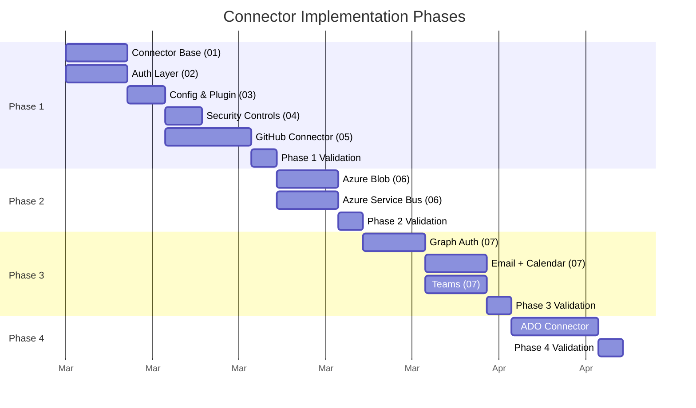

# Phases & Acceptance Criteria Specification

> Part of [Typed Connectors Plan](./00-overview.plan.md)

## Overview

This meta-spec sequences the connector implementation across four phases, defines wave-level task breakdowns within each phase, establishes per-task acceptance criteria, documents the testing approach per phase, and sets the release versioning strategy. It aggregates the task breakdowns from individual specs ([01](./01-connector-base.spec.md)–[05](./05-github-connector.spec.md)) into a unified delivery plan.

## Status

| Field | Value |
|---|---|
| Status | Active — Phase 1 complete |
| Author | AI-assisted |
| Date | 2026-02-26 |
| Updated | 2026-02-26 — Phase 1 implemented (specs 01-05, 248 tests) |
| Proposal | [00-overview.plan.md](./00-overview.plan.md) |

## Architecture

## Requirements

### Phase Sequencing

- Phase 1 MUST be completed before any other phase begins
- Phases 2 and 3 MAY overlap if Phase 1 is complete, but Phase 2 SHOULD precede Phase 3
- Phase 4 MUST NOT begin until Phase 3 is complete (depends on Graph auth patterns)
- Each phase MUST pass its validation criteria before the next phase starts

### Testing Approach

- Every connector command MUST have unit tests with mocked HTTP responses
- Every phase MUST include integration tests validating the end-to-end flow: command → middleware → auth → mocked API → `CommandResult`
- Phase 1 MUST include scenario tests using AFD `afd.testing` for GitHub workflows
- Error paths MUST be tested: auth failure, rate limiting, not found, validation errors
- Security invariants MUST be verified per phase: no token leakage, scope enforcement, input validation

### Release Versioning

- Phase 1 SHOULD release as `botcore-connectors` v0.1.0
- Phase 2 SHOULD release as v0.2.0
- Phase 3 SHOULD release as v0.3.0
- Phase 4 MAY release as v0.4.0 or be deferred
- Major version 1.0 SHOULD NOT be released until at least Phases 1-3 are stable in production

## Task Breakdown

### Phase 1: GitHub Connector (Foundation)

#### Wave 1.1: Package & Base

| Task | Spec | Acceptance Criteria |
|---|---|---|
| Create `botcore-connectors` package scaffold | [03](./03-config-and-plugin.spec.md) | `pip install -e .` succeeds; entry-point resolves |
| Define `ConnectorContext` model | [01](./01-connector-base.spec.md) | Validates with defaults; rejects invalid values |
| Implement `_api_call` with middleware | [01](./01-connector-base.spec.md) | HTTP request flows through telemetry → logging → rate limit → retry → client |
| Implement HTTP→error code mapping | [01](./01-connector-base.spec.md) | Every status code in spec table maps to correct error code |

#### Wave 1.2: Auth & Config

| Task | Spec | Acceptance Criteria |
|---|---|---|
| Implement GitHub auth chain | [02](./02-auth.spec.md) | Resolves from env var; falls back to CLI; returns error when both fail |
| Implement token cache | [02](./02-auth.spec.md) | Second resolve returns cached; expires after TTL |
| Define `ConnectorsConfig` model | [03](./03-config-and-plugin.spec.md) | Validates `[connectors]` TOML section |
| Wire `ConnectorsPlugin.register()` | [03](./03-config-and-plugin.spec.md) | Only enabled connectors registered |

#### Wave 1.3: GitHub Commands

| Task | Spec | Acceptance Criteria |
|---|---|---|
| `github_issue_create` | [05](./05-github-connector.spec.md) | Returns `IssueResult` with number and URL |
| `github_issue_list` with pagination | [05](./05-github-connector.spec.md) | `PaginationParams` maps to `page`/`per_page` |
| `github_issue_comment` | [05](./05-github-connector.spec.md) | Returns `CommentResult` with id and URL |
| `github_pr_create` | [05](./05-github-connector.spec.md) | Returns `PRResult` with draft status |
| `github_pr_list` with pagination | [05](./05-github-connector.spec.md) | Filters by state, paginates correctly |
| `github_pr_review` | [05](./05-github-connector.spec.md) | Validates event values; returns `ReviewResult` |
| `github_search_code` | [05](./05-github-connector.spec.md) | Uses `/search/code` endpoint |
| `github_search_issues` | [05](./05-github-connector.spec.md) | Uses `/search/issues` endpoint |

#### Wave 1.4: Security & Rate Limits

| Task | Spec | Acceptance Criteria |
|---|---|---|
| Input validation (max-length, repo format) | [04](./04-security-model.spec.md) | Oversized inputs rejected; `"badrepo"` rejected |
| Log sanitization for bearer tokens | [02](./02-auth.spec.md) | No token strings in any log output |
| GitHub rate limit header handling | [05](./05-github-connector.spec.md) | Pauses on `X-RateLimit-Remaining: 0` |
| Audit log emission | [04](./04-security-model.spec.md) | Every command produces structured audit entry |

#### Wave 1.5: Testing & Validation

| Task | Spec | Acceptance Criteria |
|---|---|---|
| Unit tests for all 8 GitHub commands | [05](./05-github-connector.spec.md) | Mocked HTTP: success, 401, 404, 422, 429 |
| Integration test: command→middleware→auth→API | All | End-to-end flow produces correct `CommandResult` |
| Scenario tests with `afd.testing` | [05](./05-github-connector.spec.md) | GitHub workflow scenarios pass |
| Security verification: no token leakage | [04](./04-security-model.spec.md) | Grep of test output finds zero tokens |

### Phase 2: Azure Connectors

| Task | Spec | Acceptance Criteria |
|---|---|---|
| Azure auth chain (`DefaultAzureCredential`) | [02](./02-auth.spec.md) | Resolves via env → managed identity → CLI |
| `azure_blob_upload` | [06](./06-azure-connectors.spec.md) | Uploads blob, returns URL |
| `azure_blob_download` | [06](./06-azure-connectors.spec.md) | Downloads blob content |
| `azure_blob_list` with pagination | [06](./06-azure-connectors.spec.md) | Lists blobs with continuation token |
| `azure_blob_delete` | [06](./06-azure-connectors.spec.md) | Deletes blob, confirms deletion |
| `azure_blob_upload_batch` via `execute_batch()` | [06](./06-azure-connectors.spec.md) | Batch upload with per-item results |
| `azure_queue_send` | [06](./06-azure-connectors.spec.md) | Sends message, returns message ID |
| `azure_queue_receive` | [06](./06-azure-connectors.spec.md) | Receives message with lock token |
| `azure_queue_peek` | [06](./06-azure-connectors.spec.md) | Peeks without consuming |
| `azure_queue_complete` | [06](./06-azure-connectors.spec.md) | Completes message by lock token |
| Unit + integration tests for Azure commands | [06](./06-azure-connectors.spec.md) | All commands tested with mocked Azure SDKs |

### Phase 3: Microsoft Graph Connectors

| Task | Spec | Acceptance Criteria |
|---|---|---|
| Graph auth (client credentials + device code) | [02](./02-auth.spec.md), [07](./07-graph-connectors.spec.md) | Token resolves per Graph chain |
| `email_send`, `email_search`, `email_read`, `email_reply` | [07](./07-graph-connectors.spec.md) | Graph Mail API integration |
| `calendar_create_event`, `calendar_list_events`, `calendar_update_event`, `calendar_find_availability` | [07](./07-graph-connectors.spec.md) | Graph Calendar API integration |
| `teams_send_message`, `teams_read_messages`, `teams_create_channel`, `teams_list_channels` | [07](./07-graph-connectors.spec.md) | Graph Teams API integration |
| Permission scope validation per command | [07](./07-graph-connectors.spec.md) | Commands verify required scopes |
| Unit + integration tests for Graph commands | [07](./07-graph-connectors.spec.md) | All commands tested with mocked Graph API |

### Phase 4: DevOps Connectors (Deferred)

Phase 4 is under-specified and deferred per the overview plan. A separate spec will be created when this phase approaches.

## Acceptance Criteria

### Phase 1 Gate ✅ Complete

- [x] `botcore-connectors` installs and registers via entry-point
- [x] All 8 GitHub commands return correct `CommandResult` shapes
- [x] Auth resolves from env var with CLI fallback
- [x] `[connectors].enabled` filtering works — disabled connectors have zero commands
- [x] Rate limit handling pauses on `X-RateLimit-Remaining: 0`
- [x] No tokens in logs, `CommandResult`, or config
- [x] 248 unit tests pass
- [ ] v0.1.0 released

### Phase 2 Gate

- [ ] Azure Blob CRUD operations work with mocked Azure SDK
- [ ] `azure_blob_upload_batch` uses AFD `execute_batch()` with per-item results
- [ ] Azure Service Bus send/receive/peek/complete work
- [ ] `DefaultAzureCredential` chain resolves auth
- [ ] All unit tests pass
- [ ] v0.2.0 released

### Phase 3 Gate

- [ ] Graph auth flows work (client credentials, device code)
- [ ] Email, Calendar, and Teams commands work with mocked Graph API
- [ ] Per-command permission scopes are validated
- [ ] All unit tests pass
- [ ] v0.3.0 released

## Rollback Plan

Each phase is independently rollback-able:

1. **Phase rollback:** Remove the connector modules added in that phase; decrement version
2. **Full rollback:** Remove the `botcore-connectors` package entirely
3. **Version pinning:** Downstream consumers can pin to the last known-good version (e.g., `botcore-connectors==0.1.0`)
4. No existing botcore functionality depends on connectors — removal is always safe
