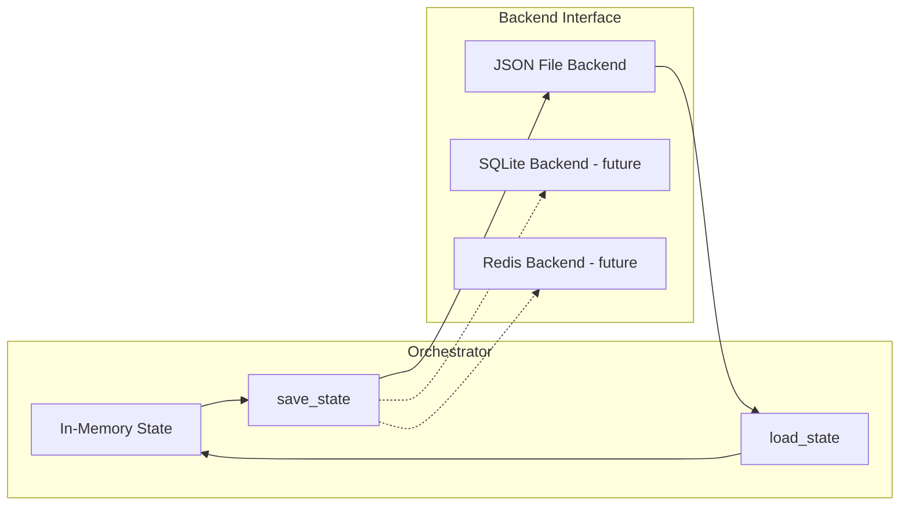

# Orchestrator State Serialization

> Foundation spec — must be implemented before adding distributed or persistent orchestration.

## Overview

The `AgentOrchestrator` currently holds all state in memory — agent pool, task queue, health snapshots. When the MCP session ends, everything is lost. This spec adds a serialization interface (`save_state()` / `load_state()`) so orchestrator state can be persisted and restored. The initial implementation uses JSON files; the interface enables future backends (SQLite, Redis) without rewriting the orchestrator.

## Status

| Field | Value |
|---|---|
| Status | Complete |
| Author | AI-assisted |
| Date | 2026-03-21 |
| Priority | Foundation (blocks persistent orchestration) |

## Problem

Current limitations:
- MCP session ends → all agents, tasks, and health history vanish
- No crash recovery — if the process restarts, orchestrator starts empty
- No handoff — can't transfer agent pool between processes
- No inspection — external tools can't read orchestrator state from disk

These don't matter for ephemeral dev-mode usage. They block:
- **Server mode** — persistent orchestrator on a VM
- **CI mode** — resume from checkpoint after pipeline stage
- **Dashboard** — external process reads orchestrator state for visualization
- **Distributed orchestration** — multiple processes share state via backend

## Architecture



## Contracts

### Plugin Configuration

```toml
[tool.botcore.plugins.agents.state]
enabled = true
backend = "json"
path = ".botcore/orchestrator-state.json"
retention_hours = 168
autosave = true
```

The persistence backend is opt-in. When disabled, the orchestrator remains purely in-memory and
`state_save()` / `state_load()` return `NO_BACKEND`.

### StateBackend Protocol

```python
from typing import Protocol

class OrchestratorStateBackend(Protocol):
    """Interface for orchestrator state persistence."""

    async def save(self, snapshot: OrchestratorSnapshot) -> None:
        """Persist orchestrator state snapshot."""
        ...

    async def load(self) -> OrchestratorSnapshot | None:
        """Load last saved state. Returns None if no state exists."""
        ...

    async def clear(self) -> None:
        """Remove persisted state."""
        ...
```

### JSON File Backend (Initial Implementation)

```python
from pathlib import Path

class JsonStateBackend:
    """Simple JSON file backend for orchestrator state."""

    def __init__(self, path: Path, retention_hours: int = 168):
        self._path = path
        self._retention_hours = retention_hours

    async def save(self, snapshot: OrchestratorSnapshot) -> None:
        """Atomically persist an indented JSON snapshot."""
        ...

    async def load(self) -> OrchestratorSnapshot | None:
        """Return None for missing or stale snapshots."""
        ...

    async def clear(self) -> None:
        self._path.unlink(missing_ok=True)
```

### Orchestrator State Shape

```python
class OrchestratorSnapshot(BaseModel):
    """Versioned persisted orchestrator state."""
    version: str = "1.0"
    timestamp: datetime
    config: AgentsPluginConfig
    agents: dict[str, AgentSnapshot]
    tasks: dict[str, TaskSnapshot]

class AgentSnapshot(BaseModel):
    """Portable agent state without live runtime/session fields."""
    name: str
    config: AgentConfig
    status_at_save: str  # stopped, idle, busy, error
    tasks_completed: int
    tasks_failed: int
    last_heartbeat: datetime | None
    # session_id, active_tasks, started_at intentionally excluded
    # restored agents always come back as stopped

class TaskSnapshot(BaseModel):
    """Portable task state for persistence and recovery."""
    id: str
    description: str
    assigned_agent: str
    status: str  # pending, assigned, running, completed, failed, cancelled
    priority: int
    result: str
    parent_task: str
    subtasks: list[str]
    created_at: datetime
    started_at: datetime | None
    completed_at: datetime | None
    retry_count: int
    max_retries: int
```

### Orchestrator API Additions

```python
class AgentOrchestrator:
    def __init__(self, config, backend: OrchestratorStateBackend | None = None):
        self._backend = backend
        # ...

    async def save_state(self) -> CommandResult[dict]:
        """Serialize current state to backend."""
        if not self._backend:
            return error("NO_BACKEND", "No state backend configured",
                        suggestion="Pass a backend to AgentOrchestrator()")
        snapshot = self._build_snapshot()
        await self._backend.save(snapshot)
        return success({"agents": len(snapshot.agents), "tasks": len(snapshot.tasks)})

    async def load_state(self) -> CommandResult[dict]:
        """Restore state from backend into a safe recovery form."""
        if not self._backend:
            return error("NO_BACKEND", "No state backend configured",
                        suggestion="Pass a backend to AgentOrchestrator()")
        snapshot = await self._backend.load()
        if snapshot is None:
            return success({"restored": False, "note": "No saved snapshot found"})
        self._restore_from_snapshot(snapshot)
        return success({
            "restored": True,
            "agents": len(snapshot.agents),
            "tasks": len(snapshot.tasks),
            "note": "Agents restore as stopped; use task_resume for pending work"
        })

    async def task_resume(self, task_id: str, agent: str = "", role: str = "") -> CommandResult[dict]:
        """Resume a persisted pending task by routing it through a running agent."""
        ...
```

## Requirements

### Functional

- AgentOrchestrator MUST accept an optional `backend` parameter (default: None, in-memory only)
- The agents plugin MUST support opt-in backend construction from config
- `save_state()` MUST serialize all agent configs, health, and task state
- `save_state()` MUST NOT serialize live LLM session references (not portable)
- `load_state()` MUST restore agent state as `stopped` (sessions must be re-created)
- Persisted state MUST use dedicated snapshot models rather than raw runtime `AgentState` / `Task`
- `load_state()` MUST normalize non-terminal tasks (`pending`, `assigned`, `running`) into resumable `pending` tasks
- `load_state()` MUST preserve terminal tasks (`completed`, `failed`, `cancelled`) within retention
- `load_state()` MUST skip completed/failed/cancelled tasks older than configurable retention
- Restored pending tasks MUST be resumable through `task_resume()`
- Snapshot MUST include a `version` field for future schema migration
- State shape MUST be JSON-serializable through the snapshot models
- `save_state()` and `load_state()` MUST return CommandResult
- Autosave SHOULD be available as an opt-in config setting
- Autosave MUST persist on durable lifecycle transitions:
  - agent create/delete/start/stop
  - task start and task finish
- Autosave SHOULD NOT run on heartbeat updates

### Non-Functional

- JSON backend write MUST be atomic (write to temp file, rename)
- No performance impact when backend is None (zero-cost opt-in)
- Snapshot SHOULD be human-readable (indented JSON)
- Missing or stale snapshots SHOULD return success with `restored=False` for automation-friendly callers
- Relative backend paths SHOULD resolve from the botcore workspace root

## Testing

| Test | Assertion |
|------|-----------|
| save_state() with no backend | Returns error with NO_BACKEND code |
| save → load roundtrip | Agent configs, health counters, task state preserved |
| Loaded agents start as stopped | No live sessions after load |
| Non-terminal tasks normalize on load | `assigned` / `running` restore as resumable `pending` tasks |
| Pending tasks survive roundtrip | Restored task can be completed via `task_resume()` after agent restart |
| Completed tasks excluded by retention | Old completed tasks not loaded |
| Autosave lifecycle coverage | Durable transitions write snapshots when autosave is enabled |
| Heartbeat remains cheap | Heartbeat does not trigger autosave |
| Version field present | Snapshot includes version for migration |
| Atomic write | Incomplete write doesn't corrupt existing state |

## Migration

- AgentOrchestrator() without backend continues to work (no persistence)
- No breaking changes to existing API
- New optional parameter only

## Risks

| Risk | Mitigation |
|------|------------|
| State file corruption | Atomic writes (temp + rename); version field for migration |
| State diverges from reality (stale) | Safe restore normalization plus opt-in autosave on durable transitions |
| Large state files | Retention policy for completed tasks; configurable max |
