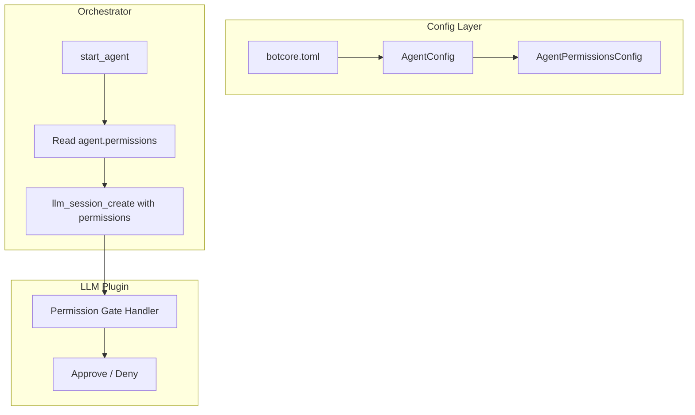

# Per-Agent Permission Profiles

> Foundation spec — must be implemented before adding new agent types or deployment modes.

## Overview

Permission gates (`allow_shell`, `allow_filesystem`, `allow_mcp`, `allow_custom_tools`) currently live in `botcore-llm` at the session level. This spec moves them to `AgentConfig` so each agent has a declared permission profile that the orchestrator applies when creating its LLM session. Without this, every agent gets the same permission profile regardless of role.

## Status

| Field | Value |
|---|---|
| Status | Complete |
| Author | AI-assisted |
| Date | 2026-02-26 |
| Priority | Foundation (blocks safe multi-agent deployment) |

## Problem

Current state in `botcore-llm/permissions.py`:
- Permission gates are per-session configuration
- The orchestrator creates sessions without specifying permissions
- All agents get the same default permission set
- No way to say "the researcher can't use shell, but the coder can"

This means:
- A research agent that should only search the web can execute shell commands
- A code review agent that should only read files can write to filesystem
- Permission profiles can't be declared in config — they're runtime-only

## Architecture



## Contracts

### AgentPermissionsConfig Model

Extends the existing `LlmPermissionsConfig` (from `botcore_llm.config`) with allowlist fields for fine-grained control. This avoids duplicating the base permission flags.

```python
from botcore_llm.config import LlmPermissionsConfig

class AgentPermissionsConfig(LlmPermissionsConfig):
    """Per-agent permission profile — extends LlmPermissionsConfig with allowlists.

    Inherits from LlmPermissionsConfig:
        allow_shell: bool = False
        allow_filesystem: bool = False
        allow_mcp: bool = True
        allow_custom_tools: bool = True
    """

    shell_allowlist: list[str] | None = None
    """If allow_shell is True, restrict to these glob patterns.

    Uses ``fnmatch.fnmatch`` against the full command string.
    Commands containing shell operators (``&&``, ``||``, ``;``, ``|``)
    MUST be denied unless every segment matches the allowlist.

    Example: ["git *", "pytest *", "ruff *"]
    None = all shell commands allowed (when allow_shell is True).
    """

    filesystem_paths: list[str] | None = None
    """If allow_filesystem is True, restrict to these path prefixes.

    Both configured paths and requested paths are resolved to absolute
    form via ``pathlib.Path.resolve()`` before ``startswith`` comparison.
    Note: symlinks are resolved by ``resolve()``, but race conditions
    between check and use (TOCTOU) remain a known limitation.

    Example: ["./src", "./tests"]
    None = all paths allowed (when allow_filesystem is True).
    """
```

### AgentConfig Extension

The real `AgentConfig` lives in `botcore_agents.config` (shown below with all actual fields). The only addition is the `permissions` field. Note: `AgentConfig` currently uses `extra="forbid"`, so `extra` must be kept as-is — the `permissions` field is added to the model source, not injected at runtime.

```python
class AgentConfig(BaseModel):
    """Configuration for a single agent."""

    model_config = ConfigDict(extra="forbid")

    name: str = ""
    role: str = ""
    model: str = ""
    skills: list[str] = Field(default_factory=list)
    connectors: list[str] = Field(default_factory=list)
    memory_scope: Literal["session", "agent", "global"] = "session"
    max_concurrent_tasks: int = Field(default=1, ge=1, le=10)
    heartbeat_interval: int = Field(default=30, ge=5, le=300)
    system_prompt: str = ""
    is_lead: bool = False

    # NEW: Per-agent permission profile
    permissions: AgentPermissionsConfig = Field(default_factory=AgentPermissionsConfig)
    """Permission profile for this agent.
    Defaults: shell=False, filesystem=False, mcp=True, custom_tools=True.
    """
```

### Config Example

```toml
# botcore.toml — under [tool.botcore.plugins.agents.agents]

[agents.researcher]
role = "research"
skills = ["web_search", "memory_read"]
[agents.researcher.permissions]
allow_shell = false
allow_filesystem = false

[agents.coder]
role = "code"
skills = ["git_diff", "file_read", "file_write", "shell_exec"]
[agents.coder.permissions]
allow_shell = true
shell_allowlist = ["git *", "pytest *", "ruff *"]
allow_filesystem = true
filesystem_paths = ["./src", "./tests"]

[agents.reviewer]
role = "review"
skills = ["git_diff", "file_read"]
# permissions defaults: no shell, no filesystem
```

### Orchestrator Integration

The orchestrator currently resolves tools via `config.skills` (not `connectors`). The only change is passing `permissions` through to `llm_session_create`. This spec is independent of the agent capability declarations spec — it only touches the permission gate layer, not tool visibility.

```python
# In AgentOrchestrator.start_agent() — current code uses config.skills for tools:
async def start_agent(self, name: str) -> CommandResult[dict]:
    # ... existing validation ...
    state = self._agents[name]

    model = state.config.model or self._config.default_model
    tools = state.config.skills or None        # skills-based tool resolution (current)
    system_prompt = state.config.system_prompt or None

    result = await llm_session_create(
        model=model,
        tools=tools,
        system_prompt=system_prompt,
        permissions=state.config.permissions,  # NEW: pass permission profile
        agent_name=name,                       # NEW: pass agent name for audit logging
    )
    # ... rest unchanged ...
```

### LLM Session Changes

```python
# In llm_session_create() — add optional permissions parameter:
async def llm_session_create(
    model: str | None = None,
    tools: list[str] | None = None,
    system_prompt: str | None = None,
    streaming: bool = True,
    permissions: AgentPermissionsConfig | None = None,  # NEW
    agent_name: str = "",                                # NEW
) -> CommandResult[dict]:
    config = _get_config()
    # ...

    # Backwards-compatible fallback: use global config if no per-agent permissions
    perms = permissions or config.permissions
    permission_handler = create_permission_handler(perms, agent_name=agent_name)

    # ... rest unchanged ...
```

### Permission Gate Handler Update

The current handler in `permissions.py` gates 6 permission kinds: `shell`, `read`, `write`, `mcp`, `custom-tool`, and `url`. The updated handler must cover all of them, incorporating allowlist checks for `shell` and path checks for `read`/`write`.

```python
def create_permission_handler(
    config: LlmPermissionsConfig,  # accepts AgentPermissionsConfig (subclass) too
    *,
    agent_name: str = "",
) -> PermissionHandlerFn:
    """Build a permission handler from the given config.

    Args:
        config: Permission configuration (LlmPermissionsConfig or AgentPermissionsConfig).
        agent_name: Agent name for audit logging (stored on SessionEntry).
    """
    # Extract allowlist fields (only present on AgentPermissionsConfig)
    shell_allowlist: list[str] | None = getattr(config, "shell_allowlist", None)
    filesystem_paths: list[str] | None = getattr(config, "filesystem_paths", None)

    def handler(
        request: PermissionRequest,
        _invocation: dict[str, str],
    ) -> PermissionRequestResult:
        kind = request.get("kind", "")

        if kind == "shell":
            if not config.allow_shell:
                logger.debug("Permission denied: shell (agent=%s)", agent_name)
                return _DENIED
            if shell_allowlist is not None:
                cmd = request.get("command", "")
                if not _matches_shell_allowlist(cmd, shell_allowlist):
                    logger.debug(
                        "Permission denied: shell command %r not in allowlist (agent=%s)",
                        cmd, agent_name,
                    )
                    return _DENIED
            return _APPROVED

        if kind in ("read", "write"):
            if not config.allow_filesystem:
                logger.debug("Permission denied: %s (agent=%s)", kind, agent_name)
                return _DENIED
            if filesystem_paths is not None:
                path = request.get("path", "")
                if not _path_allowed(path, filesystem_paths):
                    logger.debug(
                        "Permission denied: %s path %r not in allowed paths (agent=%s)",
                        kind, path, agent_name,
                    )
                    return _DENIED
            return _APPROVED

        if kind == "mcp":
            if config.allow_mcp:
                return _APPROVED
            logger.debug("Permission denied: mcp (agent=%s)", agent_name)
            return _DENIED

        if kind == "custom-tool":
            if config.allow_custom_tools:
                return _APPROVED
            logger.debug("Permission denied: custom-tool (agent=%s)", agent_name)
            return _DENIED

        if kind == "url":
            # URL fetch — always denied (no config toggle yet)
            logger.debug("Permission denied: url (agent=%s)", agent_name)
            return _DENIED

        # Unknown kind — deny by default
        logger.warning("Permission denied for unknown kind: %s (agent=%s)", kind, agent_name)
        return _DENIED

    return handler


def _matches_shell_allowlist(command: str, allowlist: list[str]) -> bool:
    """Check if command matches any pattern in the shell allowlist.

    Uses ``fnmatch.fnmatch`` against the full command string.
    Commands containing shell operators are split on operators and
    every segment must match independently.
    """
    import fnmatch
    import re

    # Split on shell operators: &&, ||, ;, |
    segments = re.split(r'\s*(?:&&|\|\||[;|])\s*', command)
    return all(
        any(fnmatch.fnmatch(seg.strip(), pat) for pat in allowlist)
        for seg in segments
        if seg.strip()
    )


def _path_allowed(requested: str, allowed_paths: list[str]) -> bool:
    """Check if requested path falls under any allowed path prefix.

    Both the requested path and each allowed path are resolved to
    absolute form via ``pathlib.Path.resolve()`` before comparison.
    """
    from pathlib import Path

    resolved = str(Path(requested).resolve())
    return any(
        resolved.startswith(str(Path(p).resolve()))
        for p in allowed_paths
    )
```

### Agent Identity in Permission Handler

The permission handler needs the agent name for audit logging but currently has no access to it. The agent name is stored on `SessionEntry` and passed into the handler via closure.

```python
# SessionEntry gets a new field:
@dataclass
class SessionEntry:
    session: CopilotSession
    model: str
    tools: list[str]
    agent_name: str = ""  # NEW: for audit logging in permission handler
    created_at: datetime = field(default_factory=lambda: datetime.now(UTC))
    config: dict[str, Any] = field(default_factory=dict)

# llm_session_create passes agent_name to the handler factory:
permission_handler = create_permission_handler(perms, agent_name=agent_name)

# And stores it on the session entry:
registry.register(
    session.session_id,
    session,
    model=model,
    tools=tool_names,
    config=session_config,
    agent_name=agent_name,
)
```

## Requirements

### Functional

- `AgentPermissionsConfig` MUST extend `LlmPermissionsConfig` (not duplicate it)
- `AgentConfig` MUST include a `permissions` field defaulting to `AgentPermissionsConfig()`
- Default permissions MUST deny shell and filesystem (secure by default)
- Default permissions MUST allow MCP and custom tools (functional by default)
- `shell_allowlist` MUST use `fnmatch.fnmatch` against the full command string
- `shell_allowlist` MUST deny commands containing shell operators (`&&`, `||`, `;`, `|`) unless every segment matches the allowlist independently
- `filesystem_paths` MUST resolve both configured and requested paths to absolute form via `pathlib.Path.resolve()` before `startswith` comparison
- Permission handler MUST cover all 6 permission kinds: `shell`, `read`, `write`, `mcp`, `custom-tool`, `url`
- Permission handler MUST read from session-specific config, not global config
- `llm_session_create` MUST accept optional `permissions` parameter
- When permissions not provided to `llm_session_create`, fall back to `config.permissions` (global defaults — backwards-compatible)
- `url` kind MUST remain always-denied (no config toggle)

### Non-Functional

- Zero overhead when permissions are default (no allowlist checking if lists are None)
- Permission denial MUST be logged with agent name and denied action for audit
- Agent name MUST be available to the permission handler via `SessionEntry.agent_name`

## Testing

| Test | Assertion |
|------|-----------|
| Default AgentPermissionsConfig | shell=False, filesystem=False, mcp=True, custom_tools=True |
| AgentPermissionsConfig inherits LlmPermissionsConfig | `issubclass(AgentPermissionsConfig, LlmPermissionsConfig)` |
| Agent with allow_shell=False | Shell commands denied |
| Agent with allow_shell=True + allowlist | Only allowlisted commands pass |
| Shell allowlist with operators | `git status && rm -rf /` denied because `rm -rf /` doesn't match |
| Agent with allow_filesystem=True + paths | Only prefixed paths allowed (after resolve) |
| Filesystem path normalization | Relative paths resolved to absolute before comparison |
| `read` kind gates on allow_filesystem | read denied when allow_filesystem=False |
| `write` kind gates on allow_filesystem | write denied when allow_filesystem=False |
| `url` kind always denied | url denied regardless of config |
| Unknown kind denied | Unknown permission kinds default to denied |
| Two agents, different profiles | Each enforces its own permissions independently |
| Session without permissions param | Uses global defaults (backwards-compatible) |
| Permission denial logged | Audit entry includes agent name + denied action |

## Relationship to Other Specs

- **Agent Capability Declarations** — `skills` (via `config.skills`) controls which tools are bridged into the LLM session; `permissions` controls which system-level actions the session is allowed to perform. This spec is independent of capability declarations — it only touches the permission gate layer, not tool visibility.
- **Orchestrator State Serialization** — `AgentPermissionsConfig` serializes naturally (Pydantic model). No special handling needed.

## Migration

- Existing configs without `permissions` block use safe defaults (inherits `LlmPermissionsConfig` defaults)
- Existing `llm_session_create` calls without `permissions` parameter continue to work (falls back to `config.permissions`)
- `AgentConfig.extra="forbid"` means the `permissions` field must be added to the model source before TOML configs containing `[permissions]` blocks will parse — otherwise Pydantic rejects the unknown field
- No breaking changes to existing callers

## Risks

| Risk | Mitigation |
|------|------------|
| Shell allowlist bypassed via shell metacharacters | Split on operators and match every segment; log all shell invocations |
| Filesystem path check bypassed via symlinks | `Path.resolve()` follows symlinks; TOCTOU race remains a known limitation |
| Permission profile too restrictive for debugging | Dev-mode override (environment variable or CLI flag) |
